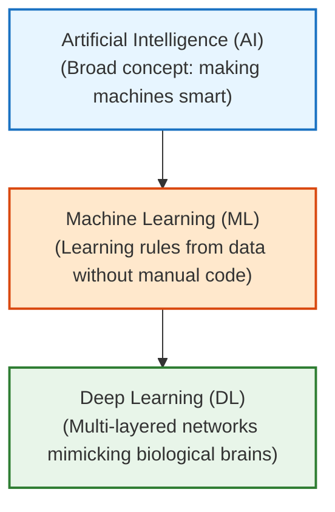
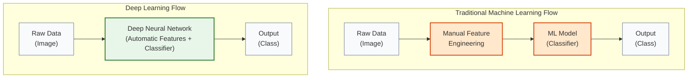
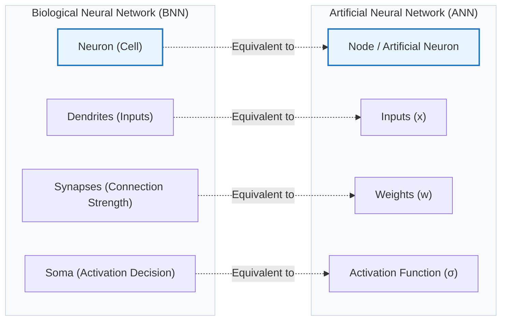

# Lesson 0001: Why Deep Learning? (The ML vs. DL Shift)

**⏱️ Duration:** 15 mins | **📖 Unit:** 1 (Introduction) | **🎯 GTU Weightage:** 10% (Unit 1)

---

> [!NOTE]
> ### 🎣 The Hook
> A 2-year-old child can look at a street dog and instantly say "doggy." Yet, for over 50 years, the smartest computer scientists in the world couldn't get a million-dollar supercomputer to do the same thing. Why? Because writing rules for what makes a dog look like a dog (ears, nose, fur, tail) is incredibly hard. Deep Learning changed everything by doing something different: it stopped trying to write rules and started trying to copy the human brain.

---

## 🗺️ The Big Picture
Where does this fit in your Artificial Intelligence journey?

> [!TIP]
> ### 🗺️ Interactive Mindmap Canvas
> We have created an interactive visual Canvas summary of this entire lesson!
> Open **[0001-deep-learning-basics-mindmap.canvas](../reference/0001-deep-learning-basics-mindmap.canvas)** inside Obsidian to view it.

---

## 1. The Problem with Traditional Machine Learning
You already know the basics of Machine Learning. In ML, if you want to classify images of cars vs. bikes, you have to tell the model exactly what features to look for. This manual process is called **feature engineering** *(extracting relevant characteristics from raw data manually)*.

> [!TIP]
> ### 💡 The Potato Analogy
> Imagine making a potato dish:
> * **Traditional ML** is like having to wash, peel, chop, and measure the potatoes yourself, and then feeding them to a cooker that only handles the final heat. 
> * **Deep Learning** is like throwing dirty, whole potatoes into a smart machine that washes, peels, chops, and cooks them all on its own.

In Deep Learning, we skip manual feature extraction. We feed the raw image directly into the model, and the model figures out what features are important on its own.

---

## 2. What is Deep Learning?
At its core, **Deep Learning** is a subset of Machine Learning that uses multi-layered artificial networks to learn representations of data. The word "deep" refers to the number of **hidden layers** *(computational layers between input and output)* in the network.

### 🧠 The Biological Inspiration (ANN vs BNN)
Deep Learning models run on **Artificial Neural Networks (ANN)** *(computer networks inspired by the human brain)*. Let's see how they compare to our biological brain parts:

| Biological Brain Part (BNN) | Artificial Equivalent (ANN) | What it does (Simplified) |
| :--- | :--- | :--- |
| **Neuron** | **Node / Artificial Neuron** | The basic unit that processes information. |
| **Dendrites** | **Inputs** | Receives signals from other neurons. |
| **Synapses (Strength)** | **Weights ($w$)** | Decides how important an incoming signal is. |
| **Soma (Cell Body)** | **Activation Function** | Combines the inputs and decides whether to fire a signal. |

---

## 3. Real-World Applications
Deep Learning runs almost every advanced technology you use today:
* **Computer Vision**: Face Unlock on your phone, self-driving cars (Tesla identifying pedestrians), and medical scans (detecting tumors).
* **Natural Language Processing (NLP)**: Google Translate, voice assistants (Alexa, Siri), and LLMs (like ChatGPT or Gemini translating and writing code).
* **Generative AI**: Creating art (Midjourney), synthetic voices, and deepfakes.

---

## 4. The Major Challenges
If Deep Learning is so powerful, why isn't it used for absolutely everything? Because it has major limitations:

1. **Extreme Data Hunger**: While a standard ML model can learn from 500 rows of Excel data, a Deep Learning model often needs millions of samples to perform well.
2. **Computational Cost**: Training these networks requires massive, power-hungry computer processors called **GPUs (Graphics Processing Units)**. It is expensive!
3. **The Black Box Problem**: A deep model might make a correct prediction, but because of its billions of parameters, it is very hard to explain *why* it made that decision. This makes it risky for medical or legal applications.

---

> [!CAUTION]
> ### 🎯 GTU Exam Corner
>
> **Q1. Differentiate between Machine Learning (ML) and Deep Learning (DL). (5 Marks)**
> 
> | Feature | Machine Learning | Deep Learning |
> | :--- | :--- | :--- |
> | **Data Size** | Works well on small/medium datasets. | Requires massive datasets to perform well. |
> | **Feature Selection** | Requires manual feature engineering. | Learns features automatically from raw data. |
> | **Training Time** | Takes minutes to hours to train. | Can take days to weeks (requires GPUs). |
> | **Hardware** | Runs fine on a standard CPU. | Needs highly parallel GPUs/TPUs. |
> | **Explainability** | Easy to interpret (e.g., Decision Trees). | Hard to interpret (Black Box). |
>
> **Q2. What is the role of Hidden Layers in Deep Learning? (2 Marks)**
> * *Answer:* Hidden layers extract hierarchical features. Lower layers find simple edges/lines, middle layers find shapes/eyes, and higher layers combine them to identify the final object (like a face or car).

---

## 🧠 Prof. Nova's Active Recall Challenge
*Don't scroll up! Close your eyes and answer these 3 simple questions in your head:*
1. What is the name of the manual process in ML that Deep Learning skips?
2. Why is Deep Learning called a "Black Box"?
3. What artificial neuron component corresponds to the biological brain's synapse strength?

---
*Next Lesson: 0002 — Artificial Neural Network Architecture*
