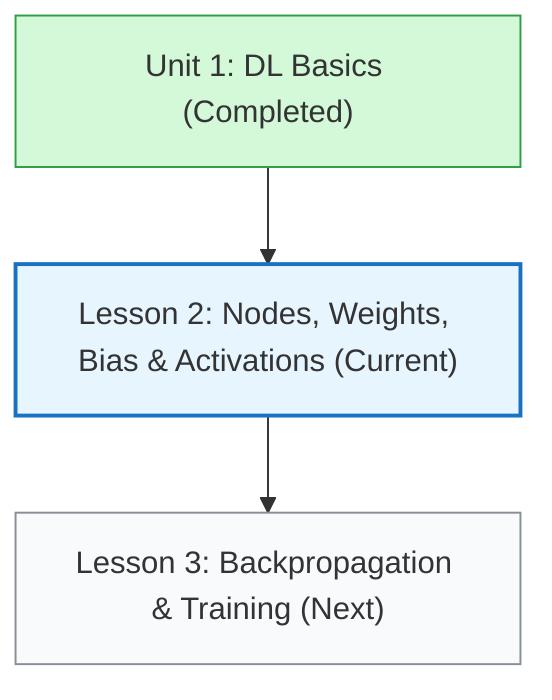
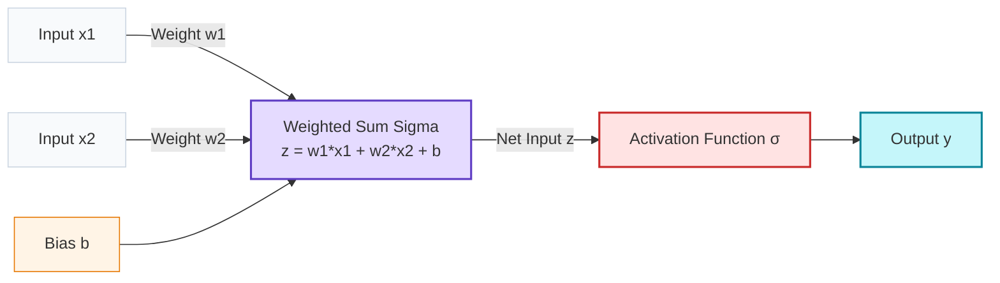
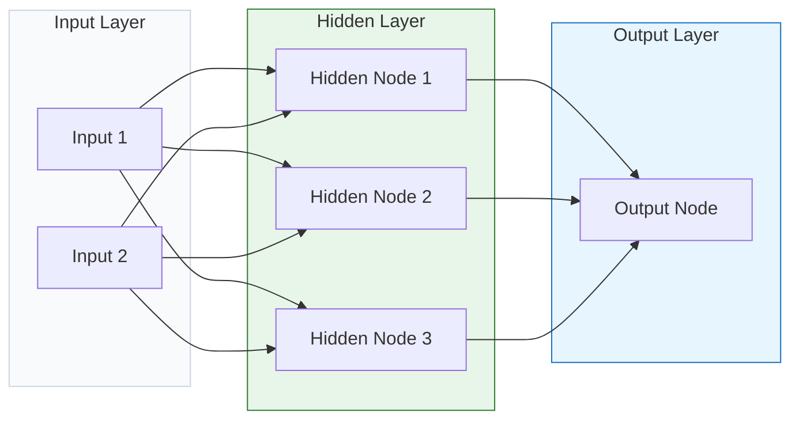

# Lesson 0002: Neural Network Architecture & Activation Functions

**⏱️ Duration:** 20 mins | **📖 Unit:** 2 (Neural Networks) | **🎯 GTU Weightage:** 25% (Unit 2)

---

> [!NOTE]
> ### 🎣 The Hook
> Imagine you are trying to decide whether to go to a music concert tonight. Your decision depends on three simple inputs: Is the weather good? Is your friend going? Is the ticket cheap? 
> You might care a lot about the weather, but not care at all if your friend goes. In a neural network, this "importance level" is called a **weight**. But what if the concert requires a minimum entrance fee? That threshold is your **bias**. Today, we'll see how computers combine these inputs, weights, and biases to make decisions just like humans do.

---

## 🗺️ The Big Picture
Where does this fit in our journey? We are moving from high-level definitions (Unit 1) to the actual gears that make a neural network work (Unit 2).

---

## 1. Inside a Single Node (The Artificial Neuron)
A neural network is made of thousands of tiny processing units called **nodes** (or neurons). Let's zoom into a single node to see how it calculates an output.

Every neuron does two simple steps of math:
1.  **The Weighted Sum ($z$):** It multiplies each input by its weight, adds them together, and adds a **bias**.
    $$z = (x_1 \cdot w_1) + (x_2 \cdot w_2) + b$$
2.  **The Activation ($\sigma$):** It passes $z$ through an **activation function** to get the final output.
    $$y = \sigma(z)$$

### ⚖️ Weights ($w$) vs. Biases ($b$)
*   **Weights ($w$):** Decide how much influence an input has on the node. (e.g., if $w_1 = 0.9$ and $w_2 = 0.1$, the network cares a lot about input $x_1$ and almost ignores $x_2$).
*   **Bias ($b$):** An offset value added to the sum. It controls how easy it is to trigger the neuron. Without a bias, if all inputs ($x$) are $0$, the output of the sum is always $0$. A bias allows the node to output a signal even when the inputs are zero.

---

## 2. The Multi-Layer Network Structure (MLP)
Nodes are arranged in layers to form a **Multi-Layer Perceptron (MLP)**:

*   **Input Layer:** Receives the raw data (e.g., image pixels or word counts).
*   **Hidden Layers:** Intermediate layers that do the heavy lifting of extracting features. A network is "deep" if it has multiple hidden layers.
*   **Output Layer:** Produces the final prediction (e.g., class label or stock price).

---

## 3. Activation Functions: The Non-Linear Gatekeepers
An **activation function** is a mathematical formula that decides whether a neuron should "fire" (output a strong signal) or not.

### ❓ Why do we need Activation Functions?
Without activation functions, a neural network is just a series of linear additions and multiplications ($z = wx+b$). **No matter how many layers you stack, a combination of linear functions is still just a linear function (a straight line).**
Activation functions introduce **non-linearity**, allowing the network to learn complex curves, waves, and patterns (like recognizing shapes or speech).

### ⚙️ The Three Most Common Activation Functions (GTU favorites!)

#### 1. Sigmoid Function
Maps any input to a value between **0 and 1**.
*   **Formula:** $\sigma(z) = \frac{1}{1 + e^{-z}}$
*   **Best for:** The output layer of a binary classifier (since the output represents a probability between 0% and 100%).
*   **Drawback:** If the input is very large or very small, the curve gets very flat, which slows down learning (called the **vanishing gradient problem**).

#### 2. Tanh (Hyperbolic Tangent)
Maps any input to a value between **-1 and 1**.
*   **Formula:** $\tanh(z) = \frac{e^z - e^{-z}}{e^z + e^{-z}}$
*   **Best for:** Hidden layers. Since the output is zero-centered (average output is close to 0), it makes training the next layer easier.
*   **Drawback:** Also suffers from the vanishing gradient problem when inputs are extreme.

#### 3. ReLU (Rectified Linear Unit)
If the input is negative, it outputs **0**. If the input is positive, it outputs the **same value**.
*   **Formula:** $f(z) = \max(0, z)$
*   **Best for:** Almost all hidden layers in modern deep learning models.
*   **Advantages:** It is incredibly fast to calculate, and it does not suffer from vanishing gradients for positive inputs.

---

> [!CAUTION]
> ### 🎯 GTU Exam Corner
>
> **Q1. What is an Activation Function? Why is it required in Neural Networks? (5 Marks)**
> *   **What it is:** A mathematical function applied to the net input of a neuron to determine its output.
> *   **Why it's required:** It introduces non-linearity. Without it, the neural network acts as a single-layer linear regression model and cannot learn complex, non-linear patterns (like images or voice).
>
> **Q2. Compare Sigmoid, Tanh, and ReLU activation functions. (7 Marks)**
> 
> | Feature | Sigmoid | Tanh | ReLU |
> | :--- | :--- | :--- | :--- |
> | **Output Range** | 0 to 1 | -1 to 1 | 0 to $\infty$ |
> | **Zero-Centered** | No | Yes | No |
> | **Common Use** | Output layer (binary classification) | Hidden layers (historical) | Hidden layers (modern standard) |
> | **Pros** | Good for probability outputs. | Zero-centered outputs speed up learning. | Extremely fast; avoids vanishing gradients. |
> | **Cons** | Suffer from vanishing gradients. | Suffer from vanishing gradients. | Can cause "dying ReLU" (nodes outputting 0 forever). |

---

## 🧠 Prof. Nova's Active Recall Challenge
*Don't scroll up! Answer these questions in your head:*
1. Why is a network with many hidden layers but no activation functions just a linear regression model?
2. What activation function outputs values between -1 and 1?
3. What is the mathematical formula for ReLU?

---
*Next Lesson: 0003 — Backpropagation & Neural Network Training*
