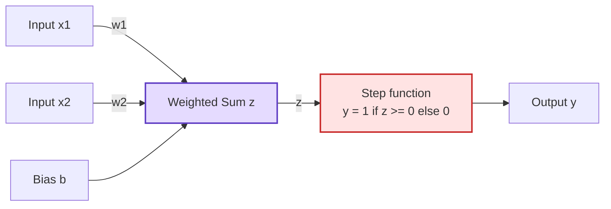
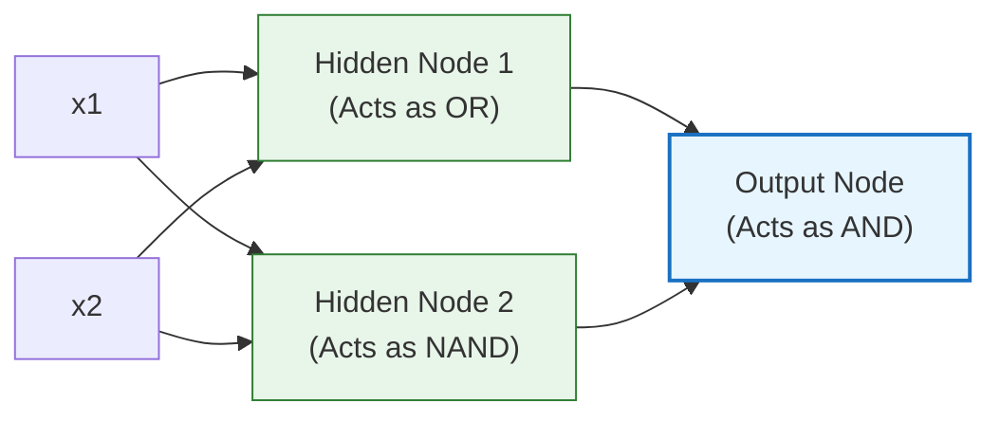

# Lesson 0002b: The Perceptron & The XOR Problem

**⏱️ Duration:** 15 mins | **📖 Unit:** 2 (Neural Networks) | **🎯 GTU Weightage:** 15% (Unit 2)

---

> [!NOTE]
> ### 🎣 The Hook
> Imagine you have a table with red apples and green apples on it. 
> * If all the red apples are on the left and the green apples are on the right, you can easily place a long wooden ruler (a straight line) between them to separate them. This is called **linear separability**.
> * But what if they are placed diagonally? Red apples at the top-left and bottom-right, and green apples at the top-right and bottom-left. Try as you might, you can **never** place a single straight ruler to separate the red ones from the green ones. 
> This simple geometric puzzle is the famous **XOR Problem**. In 1969, it mathematically proved that the earliest form of artificial intelligence (the Perceptron) was severely limited, shutting down AI research funding for over a decade!

---

## 🗺️ The Big Picture
Where does this fit? In Lesson 2, we looked at modern nodes. Today, we step back to look at the historical "grandfather" of neural networks—the **Perceptron**—and understand why we were forced to stack them into Multi-Layer Perceptrons (MLPs).

```mermaid
graph TD
    L2["Lesson 2: Nodes & Activations (Completed)"] ──> L2b["Lesson 2b: Perceptron & XOR Problem (Current)"]
    L2b ──> L3["Lesson 3: Backpropagation & Training (Next)"]

    style L2 fill:#d3f9d8,stroke:#2f9e44,stroke-width:1px
    style L2b fill:#e7f5ff,stroke:#1971c2,stroke-width:2px
    style L3 fill:#f8fafc,stroke:#868e96,stroke-width:1px
```

---

## 1. The Single-Layer Perceptron (SLP)
Invented by Frank Rosenblatt in 1958, the **Perceptron** is the simplest form of a neural network used for binary classification.

### ⚙️ How it works:
It takes inputs, multiplies them by weights, adds a bias, and passes the sum through a simple **Step Activation Function** (Threshold function).



*   **Step Function Formula:**
    $$y = \begin{cases} 1 & \text{if } \sum w_i x_i + b \ge 0 \\ 0 & \text{if } \sum w_i x_i + b < 0 \end{cases}$$
*   **The Decision Boundary:** Because it uses a simple sum, the boundary line where the classification changes from $0$ to $1$ is a **straight line** (a linear hyperplane: $w_1 x_1 + w_2 x_2 + b = 0$).

---

## 2. Linear Separability & The Logic Gates
A dataset is **linearly separable** if you can separate the classes with a single straight line. Perceptrons can solve any linearly separable logic gate:

### 🟢 AND Gate (Linearly Separable)
*Output is 1 only if BOTH inputs are 1.*

| $x_1$ | $x_2$ | Output |
| :--- | :--- | :--- |
| 0 | 0 | **0** |
| 0 | 1 | **0** |
| 1 | 0 | **0** |
| 1 | 1 | **1** |

*   **Line representation:** We can easily draw a single line that separates $(1,1)$ from the other three points.

### 🟢 OR Gate (Linearly Separable)
*Output is 1 if AT LEAST ONE input is 1.*

| $x_1$ | $x_2$ | Output |
| :--- | :--- | :--- |
| 0 | 0 | **0** |
| 0 | 1 | **1** |
| 1 | 0 | **1** |
| 1 | 1 | **1** |

*   **Line representation:** We can easily draw a single line that separates $(0,0)$ from the other three points.

---

## 3. The XOR Problem (The Non-Linear Wall)
**XOR (Exclusive OR)** outputs $1$ if the inputs are **different**, and $0$ if they are the **same**.

| $x_1$ | $x_2$ | Output |
| :--- | :--- | :--- |
| 0 | 0 | **0** (Same) |
| 0 | 1 | **1** (Different) |
| 1 | 0 | **1** (Different) |
| 1 | 1 | **0** (Same) |

Let's look at the coordinates plotted on a 2D graph:
```
  x2
  ▲
1 ┼  (0,1) [1]          (1,1) [0]
  │
  │
0 ┼  (0,0) [0]          (1,0) [1]
  ┼───────────────────────────────► x1
     0                  1
```
Try to draw a single straight line that separates the `[1]` points from the `[0]` points. **It is geometrically impossible.** 

> [!IMPORTANT]
> Because the Single-Layer Perceptron can only draw straight decision boundaries, **it cannot solve the XOR problem.**

---

## 🛠️ The Solution: Multi-Layer Perceptron (MLP)
To solve the XOR problem, we must add a **hidden layer** between the inputs and outputs. By adding a hidden layer, we warp the 2D space, allowing the network to combine intermediate features and draw **non-linear (curved/complex) decision boundaries**.



*   **How it works:**
    1.  Node 1 ($h_1$) fires if either input is on (**OR** function).
    2.  Node 2 ($h_2$) fires if both inputs are NOT on (**NAND** function).
    3.  The Output Node ($out$) fires only if both $h_1$ and $h_2$ fire (**AND** function).
    Combining these simple linear decisions allows the network to solve the XOR gate!

---

> [!CAUTION]
> ### 🎯 GTU Exam Corner
>
> **Q1. What is the XOR problem in Perceptrons? Explain why a single-layer perceptron cannot solve it. (5 Marks)**
> *   **Core Answer:** The XOR problem represents a classification task where classes are not linearly separable. A single-layer Perceptron computes a linear combination of inputs followed by a step function, which restricts its decision boundary to a straight line (hyperplane). Because XOR outputs are distributed diagonally on a 2D plane, no single straight line can separate the outputs. Thus, a single-layer perceptron fails to learn the XOR mapping.
>
> **Q2. Differentiate between Single-Layer Perceptron (SLP) and Multi-Layer Perceptron (MLP). (5 Marks)**
> 
> | Feature | Single-Layer Perceptron (SLP) | Multi-Layer Perceptron (MLP) |
> | :--- | :--- | :--- |
> | **Layers** | 1 Input, 1 Output (No hidden layers). | Input, one or more Hidden layers, Output. |
> | **Decision Boundary** | Strictly Linear (straight line). | Non-linear (curves, complex shapes). |
> | **Activation** | Simple Step/Threshold function. | Continuous/Non-linear (Sigmoid, Tanh, ReLU). |
> | **Application** | Simple logic gates (AND, OR, NOT). | Complex tasks (XOR, Computer Vision, NLP). |

---

## 🧠 Prof. Nova's Active Recall Challenge
*Don't scroll up! Answer these questions in your head:*
1. Who invented the Perceptron, and in what year?
2. What does it mean for a dataset to be "linearly separable"?
3. How many hidden layers does a Single-Layer Perceptron have?

---
*Next Lesson: 0003 — Backpropagation & Neural Network Training*
