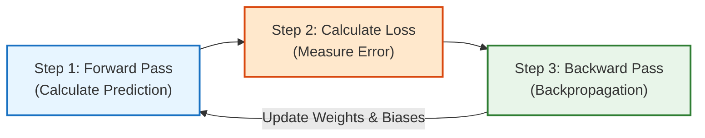
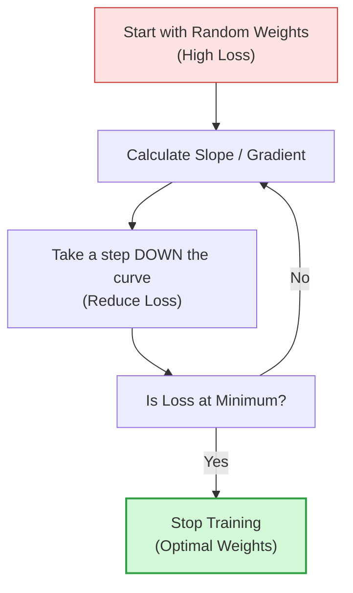

# Lesson 0003: Backpropagation & Neural Network Training

**⏱️ Duration:** 20 mins | **📖 Unit:** 2 (Neural Networks) | **🎯 GTU Weightage:** 25% (Unit 2)

---

> [!NOTE]
> ### 🎣 The Hook
> Imagine you are blindfolded and trying to throw a basketball into a hoop. 
> * The first time, you throw it, and your friend yells: *"It landed 3 feet too far to the left!"* (This is the **Error / Loss**).
> * The second time, you adjust your arm strength and angle slightly to the right (This is adjusting the **Weights**).
> * You repeat this until you score. 
> This is exactly how a neural network learns. It makes a guess, calculates how wrong it was, and walks backward through the network to adjust its settings. This backward walk is called **Backpropagation**.

---

## 🗺️ The Big Picture
Where does this fit? We now know how a network calculates outputs (Forward Propagation). Today, we learn how it actually *learns* from its mistakes (Training).

```mermaid
graph TD
    L2["Lesson 2: Architecture & Activations (Completed)"] ──> L3["Lesson 3: Backpropagation & Training (Current)"]
    L3 ──> L4["Lesson 4: Deep Feedforward Networks & Use Cases (Next)"]

    style L2 fill:#d3f9d8,stroke:#2f9e44,stroke-width:1px
    style L3 fill:#e7f5ff,stroke:#1971c2,stroke-width:2px
    style L4 fill:#f8fafc,stroke:#868e96,stroke-width:1px
```

---

## 1. The 3-Step Training Loop
Training a neural network is an iterative loop consisting of three main phases:



### 🔹 Step 1: Forward Propagation (Forward Pass)
Inputs are fed into the input layer, multiplied by weights, added to biases, passed through activation functions, and passed forward until the output layer makes a prediction ($y_{pred}$).

### 🔹 Step 2: The Loss Function (Calculating Error)
A **Loss Function** (or Cost Function) is a mathematical formula that measures how far the network's prediction is from the actual truth ($y_{true}$).
*   **GTU Favorite — Mean Squared Error (MSE):** Used for regression tasks (predicting numbers).
    $$MSE = \frac{1}{n} \sum (y_{true} - y_{pred})^2$$
    If the loss is high, the model did a poor job. The goal of training is to get the loss as close to **0** as possible.

### 🔹 Step 3: Backpropagation (Backward Pass)
Once we have the loss, the network goes backward. It uses the **Chain Rule of Calculus** to calculate how much each individual weight and bias in the network contributed to the final error.
*   It calculates the **gradient** (derivative of the loss function with respect to each weight, written as $\frac{\partial L}{\partial w}$).
*   If the gradient is positive, increasing the weight increases the error. If the gradient is negative, increasing the weight decreases the error.

---

## 2. Gradient Descent: The Optimizer
Once the network knows the gradients (which direction increases or decreases the error), it uses an optimization algorithm called **Gradient Descent** to update the weights.



Think of Gradient Descent as walking down a dark mountain to find the valley floor (the lowest point of loss). At each step, you feel the slope of the ground under your feet:
*   If the slope is steep, you take a step down.
*   You update the weights using this formula:
    $$w_{new} = w_{old} - \alpha \cdot \frac{\partial L}{\partial w}$$

### ⚡ The Learning Rate ($\alpha$)
The **learning rate ($\alpha$)** is a small decimal (like $0.01$ or $0.001$) that determines the size of the step we take down the loss curve.

*   **If $\alpha$ is too small:** The model takes tiny steps. It will take a very long time to train (converge).
*   **If $\alpha$ is too large:** The model takes giant leaps. It might overshoot the bottom of the valley, bounce back and forth, and never find the lowest error (divergence).

---

> [!CAUTION]
> ### 🎯 GTU Exam Corner
>
> **Q1. Explain the Backpropagation algorithm with a neat flowchart. (7 Marks)**
> *   **Core concept:** It is the backward pass in neural network training that computes the gradient of the loss function with respect to weights using the chain rule of calculus.
> *   **Flowchart Steps:**
>     1. Initialize weights randomly.
>     2. Feed input forward to calculate output ($y_{pred}$).
>     3. Compute loss (error) between output and target.
>     4. Calculate gradients starting from the output layer back to the input layer using the chain rule: $\frac{\partial L}{\partial w} = \frac{\partial L}{\partial y} \cdot \frac{\partial y}{\partial z} \cdot \frac{\partial z}{\partial w}$.
>     5. Update weights: $w \leftarrow w - \alpha \frac{\partial L}{\partial w}$.
>     6. Repeat until the loss converges.
>
> **Q2. What is the role of the Learning Rate in training? What happens if it is too high or too low? (5 Marks)**
> *   **Role:** It acts as the step size parameter in Gradient Descent.
> *   **Too Low:** Extremely slow training; might get stuck in local minima.
> *   **Too High:** Overshoots the global minimum, causing the model to diverge and fail to learn.

---

## 🧠 Prof. Nova's Active Recall Challenge
*Don't scroll up! Close your eyes and test yourself:*
1. What mathematical calculus rule is used by backpropagation to transfer gradients backward?
2. Write down the update formula for weights in Gradient Descent.
3. What is the danger of setting the learning rate ($\alpha$) too high?

---
*Next Lesson: 0004 — Deep Feedforward Networks & Use Cases*
