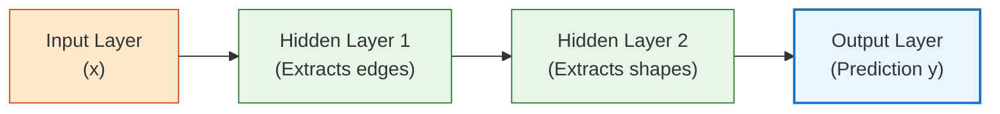
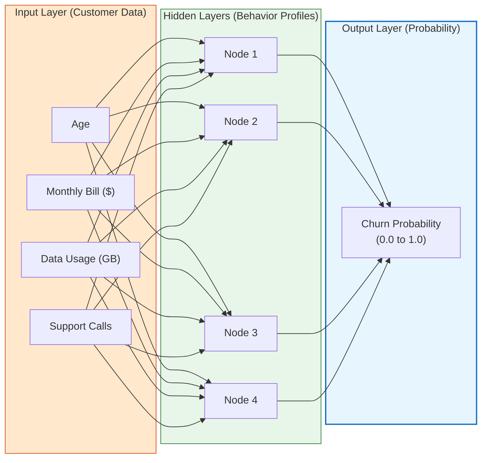

# Lesson 0004: Deep Feedforward Networks & Use Cases

**⏱️ Duration:** 20 mins | **📖 Unit:** 2 (Neural Networks) | **🎯 GTU Weightage:** 25% (Unit 2)

---

> [!NOTE]
> ### 🎣 The Hook
> Imagine a high-efficiency assembly line at a car factory. Steel sheets enter at one end, are stamped into shapes, welded together, painted by robots, and finally roll out as complete cars at the other end. Crucially, the conveyor belt only moves in **one direction**. A half-built car never goes backward on the track. 
> This is exactly how a **Deep Feedforward Network** (also called a Multilayer Perceptron or MLP) processes information. Data goes in, travels forward layer-by-layer, gets processed, and exits as a prediction. There are no feedback loops.

---

## 🗺️ The Big Picture
Where does this fit? We now know how individual nodes work (Lesson 2) and how the network trains (Lesson 3). Today, we look at the full multi-layered feedforward structure and how it is applied to solve real industry problems.

```mermaid
graph TD
    L3["Lesson 3: Backpropagation (Completed)"] ──> L4["Lesson 4: Deep Feedforward Networks & Use Cases (Current)"]
    L4 ──> L5["Lesson 5: TensorFlow & Transfer Learning (Next)"]

    style L3 fill:#d3f9d8,stroke:#2f9e44,stroke-width:1px
    style L4 fill:#e7f5ff,stroke:#1971c2,stroke-width:2px
    style L5 fill:#f8fafc,stroke:#868e96,stroke-width:1px
```

---

## 1. Deep Feedforward Networks (DFFN)
A **Deep Feedforward Network** is the quintessential deep learning model. The goal of a feedforward network is to approximate some function $y = f^*(x)$. For example, a classifier maps an input $x$ to a category $y$. 

### ⚙️ Why is it called "Feedforward"?
*   **Feedforward:** Information flows in one direction only: from the input layer, through the hidden layers, to the output layer. There are **no feedback connections** where outputs are fed back into the same layer (networks that do have feedback loops are called *Recurrent Neural Networks* or RNNs).
*   **Deep:** The network has multiple hidden layers (often tens or hundreds in industry models).



---

## 2. A Real-World Use Case: Customer Churn Prediction
Let's see how a telecom company (like Jio or Airtel) uses a Deep Feedforward Network to predict **customer churn** *(whether a customer is going to cancel their subscription)*.



### How the data flows:
1.  **Inputs ($x$):** The network takes raw customer attributes (Age, Bill, Usage, Calls).
2.  **Hidden Layers ($h$):** The hidden nodes combine these inputs to detect hidden, abstract patterns. For example, one hidden node might trigger only when a customer has *low usage but high support calls* (indicating frustration).
3.  **Output ($y$):** The output node uses a **Sigmoid** activation function to output a single probability score between $0$ (loyal customer) and $1$ (will cancel). If the score is $>0.5$, the company sends the customer a discount coupon.

---

## 3. ANN vs. BNN (Deep Dive)
While Artificial Neural Networks (ANN) are *inspired* by the Biological Neural Networks (BNN) in our brain, they are actually very different in how they function.

| Feature | Biological Neural Network (BNN) | Artificial Neural Network (ANN) |
| :--- | :--- | :--- |
| **Processing Element** | Synapse-connected neurons (billion-fold parallelism). | Nodes running on silicon processors (CPUs/GPUs). |
| **Learning Mechanism** | Complex biochemical changes (Synaptic Plasticity). | Backpropagation & Gradient Descent (Calculus). |
| **Speed** | Slow signal transmission (milliseconds). | Near speed-of-light calculations (nanoseconds). |
| **Energy Efficiency** | Extremely efficient (runs on ~20 Watts). | Highly inefficient (needs hundreds of Watts for GPUs). |
| **Architecture** | Highly complex, dynamic, self-rewiring loops. | Fixed, layered static layouts. |

---

> [!CAUTION]
> ### 🎯 GTU Exam Corner
>
> **Q1. Write a detailed note on Deep Feedforward Networks with a neat block diagram. (5 Marks)**
> *   **Definition:** Feedforward networks are multilayered networks where connections flow strictly in one direction (forward) and do not form cycles.
> *   **Block Diagram:** Draw the Input Layer ➡️ Hidden Layer 1 ➡️ Hidden Layer 2 ➡️ Output Layer diagram.
> *   **Purpose:** They represent the basis for advanced architectures like CNNs and RNNs.
>
> **Q2. Differentiate between Artificial Neural Networks (ANN) and Biological Neural Networks (BNN). (5 Marks)**
> *   **Points to cover:** Compare their processing elements (nodes vs. biological neurons), learning mechanisms (Backpropagation vs. synaptic plasticity), speed (fast electronics vs. slow chemical impulses), and power consumption.
>
> **Q3. Explain any one application/use case of ANN in detail. (7 Marks)**
> *   *Tip:* Use the **Customer Churn Prediction** or **House Price Prediction** case study. Clearly lay out the inputs (features), what happens in the hidden layers (feature extraction), and what the output represents.

---

## 🧠 Prof. Nova's Active Recall Challenge
*Don't scroll up! Close your eyes and test yourself:*
1. What makes a network "feedforward" instead of "recurrent"?
2. What activation function would you use in the output layer for Customer Churn Prediction?
3. Name two advantages BNNs have over ANNs (hint: think energy and wiring).

---
*Next Lesson: 0005 — TensorFlow & Transfer Learning*
