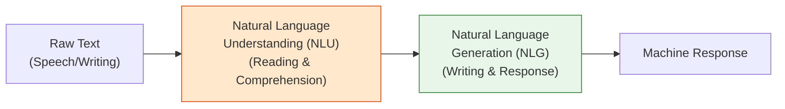
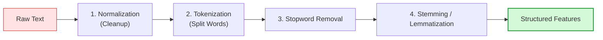

# Lesson 0001: Why is NLP Hard? The Pipeline & Libraries

**⏱️ Duration:** 20 mins | **📖 Unit:** 1 (Introduction to NLP) | **🎯 GTU Weightage:** 14% (Unit 1)

---

> [!NOTE]
> ### 🎣 The Hook
> When you type a message on your phone, how does it predict the next word? When you speak to Siri or Alexa, how does it know that *"call me a cab"* means you want a taxi, and not that your name is *"cab"*?
> Human language is the most complex data structure on Earth. It is full of sarcasm, double meanings, typos, and history. Making a computer understand human language isn't just about matching words in a dictionary; it requires teaching it to read between the lines. This is the challenge of **Natural Language Processing (NLP)**.

---

## 🗺️ The Big Picture
Where does this fit? Natural Language Processing sits at the intersection of Linguistics, Computer Science, and Artificial Intelligence. Today, we look at why human language is so hard for computers, and how we use a structured **pipeline** to clean and prepare text for machine learning models.

```mermaid
graph TD
    L1["Lesson 1: Why is NLP Hard? The Pipeline & Libraries (Current)"] ──> L2["Lesson 2: Language Modeling & N-grams (Next)"]

    style L1 fill:#e7f5ff,stroke:#1971c2,stroke-width:2px
    style L2 fill:#f8fafc,stroke:#868e96,stroke-width:1px
```

---

## 1. Why is NLP Difficult? (The Wall of Ambiguity)
Unlike programming languages (which have strict, logical syntax rules), human language is inherently **ambiguous**. A single sentence can mean completely different things depending on context.

### ⚠️ The 4 Types of Ambiguity (GTU Favorites!)
To explain why NLP is hard, we look at the four levels of ambiguity:

1.  **Lexical Ambiguity (Word Level):** A word has multiple meanings.
    *   *Example:* *"I went to the **bank**."* (Is it a river bank or a money bank?)
2.  **Syntactic Ambiguity (Grammar Level):** The structure of the sentence can be parsed in multiple ways.
    *   *Example:* *"I saw a man with a telescope."* (Who had the telescope? Did I use a telescope to see the man, or did the man have a telescope in his hand?)
3.  **Semantic Ambiguity (Meaning Level):** The literal meaning of a phrase is unclear.
    *   *Example:* *"The car hit the pole while it was moving."* (Was the car moving, or was the pole moving?)
4.  **Pragmatic Ambiguity (Context Level):** The sentence requires real-world social context to understand the intent.
    *   *Example:* *"Can you pass the salt?"* (Literally: a yes/no question about physical capability. Pragmatically: a request to physically hand over the salt).

---

## 2. NLU vs. NLG: The Two Components
NLP is split into two halves:



*   **Natural Language Understanding (NLU):** Focuses on reading comprehension. It takes raw text and extracts the **intent** and meaning (e.g., figuring out that *"book a flight"* is an order). This is considered the **harder** problem.
*   **Natural Language Generation (NLG):** Focuses on producing text. It takes structured data and converts it into grammatically correct human sentences.

---

## 3. The NLP Pipeline (Step-by-Step)
To feed human text into a computer model, we must pass it through a cleaning and structural process called the **NLP Pipeline**.



### 🛠️ The 4 Core Pipeline Steps:
1.  **Normalization (Text Cleaning):** Convert all letters to lowercase, remove HTML tags, strip out special characters, and clean typos.
2.  **Tokenization:** Splitting a block of text into individual units called **tokens** (usually words or punctuation).
    *   *Example:* `"NLP is fun!"` ➡️ `["NLP", "is", "fun", "!"]`
3.  **Stopwords Removal:** Filtering out common words (like *"the"*, *"is"*, *"a"*, *"at"*) that appear frequently but carry very little unique information or semantic meaning.
4.  **Stemming vs. Lemmatization (Reducing Words to Roots):**
    *   **Stemming:** A crude, rule-based approach that chops off the suffixes of words. It is fast but often results in non-words.
        *   *Example:* `"running"`, `"runs"` ➡️ `"run"` | `"studies"`, `"studying"` ➡️ `"studi"` (studi is not a real word).
    *   **Lemmatization:** A dictionary-based approach that uses grammatical context to reduce a word to its real root lemma. It is slower but grammatically correct.
        *   *Example:* `"studies"`, `"studying"` ➡️ `"study"` | `"was"`, `"is"` ➡️ `"be"`.

---

## 4. NLP Libraries: NLTK vs. spaCy
When coding NLP systems, developers rely on two major Python libraries:

| Feature | NLTK (Natural Language Toolkit) | spaCy |
| :--- | :--- | :--- |
| **Primary Audience** | Academics, Researchers, Educators. | Software Engineers, Production Environments. |
| **Philosophy** | Provides multiple algorithms for each task (highly customizable). | Provides one highly optimized pre-trained pipeline per task. |
| **Speed** | Relatively slow (written in pure Python). | Extremely fast (written in optimized Cython). |
| **Ease of Use** | Requires manual setup and choosing algorithms. | Plug-and-play pipelines (`doc = nlp("text")`). |

---

> [!CAUTION]
> ### 🎯 GTU Exam Corner
>
> **Q1. Why is Natural Language Processing difficult? Explain with examples of ambiguity. (5 Marks)**
> *   **Core Answer:** Human language is unstructured and highly ambiguous. Highlight the **4 types of ambiguity** (Lexical, Syntactic, Semantic, Pragmatic) with the exact examples listed in Section 1.
>
> **Q2. Compare Stemming and Lemmatization. (5 Marks)**
> *   **Stemming:** Crude, heuristic-based chopping of suffixes (e.g., `"replacing"` ➡️ `"replac"`). Fast but can create non-dictionary words.
> *   **Lemmatization:** Vocabulary and morphological analysis to find the base form (e.g., `"replacing"` ➡️ `"replace"`). Slower but grammatically accurate.
>
> **Q3. Draw and explain the phases of an NLP pipeline. (7 Marks)**
> *   *Tip:* Draw the flowchart from Section 3. Clearly define each stage: Text Normalization, Tokenization, Stopwords Removal, and Stemming/Lemmatization, detailing their inputs and outputs.

---

## 🧠 Prof. Nova's Active Recall Challenge
*Don't scroll up! Close your eyes and test yourself:*
1. What type of ambiguity is demonstrated by the phrase: *"I saw a man with a telescope"*?
2. Which library is faster and better for production applications: NLTK or spaCy?
3. What is the base form of the verb *"was"* when run through a Lemmatizer?

---
*Next Lesson: 0002 — Language Modeling & N-grams*
