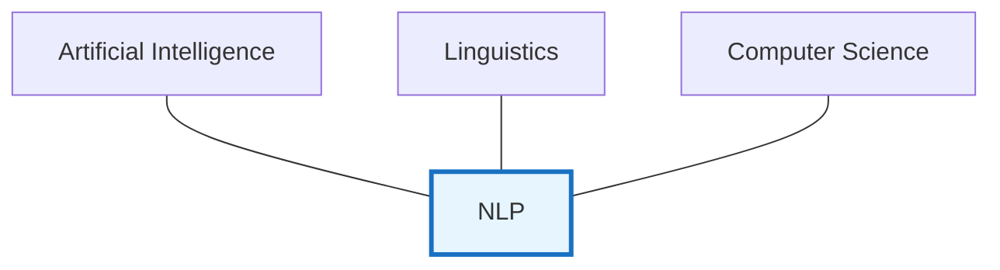
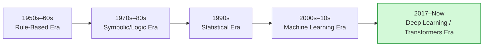
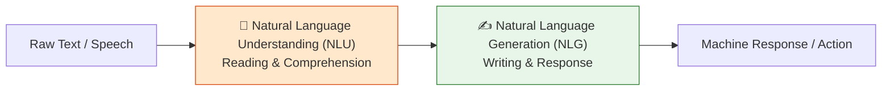
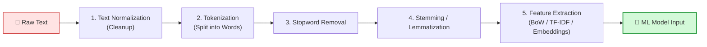
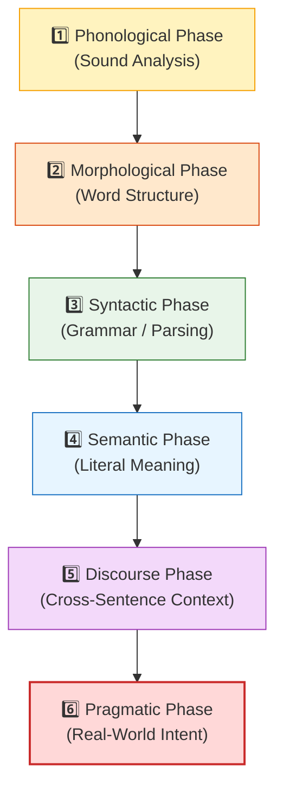

# Unit 1: Introduction to NLP — Complete Study Notes
**Subject:** Natural Language Processing (3174205) | **Unit 1 of 5** | **6 Hours | 14% Weightage**

---

> [!NOTE]
> ### 🎣 The Hook
> Your phone predicts your next word. Google understands your questions, not just keywords. Siri talks back. Grammarly fixes your grammar. ChatGPT writes essays.
> All of these run on **Natural Language Processing** — the field of AI that teaches computers to read, understand, and generate human language. But human language is messy, sarcastic, ambiguous, and full of history. Let's understand why.

---

## Topic 1: What is NLP?

**Natural Language Processing (NLP)** is a branch of Artificial Intelligence (AI) and Computational Linguistics that enables computers to:
- **Read** and understand written text (Natural Language Understanding — NLU)
- **Write** and generate human-like text (Natural Language Generation — NLG)
- **Speak** and process spoken language (Speech Recognition)

> 💡 *Simple definition:* NLP = Teaching computers to work with human language (English, Hindi, etc.) the way humans do — understanding meaning, not just matching letters.

NLP sits at the intersection of three fields:

---

## Topic 2: Why is NLP Difficult?

Human language is unlike any programming language. It is **inherently ambiguous** — the same words can mean different things depending on context, tone, culture, and history.

### The 4 Types of Ambiguity 🔥 *(3–5 marks, asked in W23, W25)*

| Type | Level | Example | Why it Confuses Computers |
|------|-------|---------|--------------------------|
| **Lexical** | Word | *"I went to the **bank**"* | "bank" = river bank OR money bank? |
| **Syntactic** | Grammar | *"I saw a man with a telescope"* | Did I use the telescope, or did the man have it? |
| **Semantic** | Meaning | *"The car hit the pole while **it** was moving"* | Was the car or the pole moving? |
| **Pragmatic** | Context/Intent | *"Can you pass the salt?"* | Is this a question about ability, or a polite request? |

### Other Reasons NLP is Hard:
- **Informal language:** Slang, emojis, abbreviations (`lol`, `brb`, `gonna`)
- **Coreference:** *"Alice met Bob. **She** was happy."* — Who is "she"?
- **Metaphors/Idioms:** *"It's raining cats and dogs"* has no cats or dogs.
- **Spelling errors:** Humans make typos constantly.
- **Low-resource languages:** Many world languages have little digital text to train on.

---

## Topic 3: History of NLP

NLP did not appear overnight. It evolved through distinct eras:

| Era | Period | Key Development |
|-----|--------|-----------------|
| **Rule-Based** | 1950s–60s | Alan Turing proposed the Turing Test (1950). Hand-written grammar rules. ELIZA chatbot (1966) — first conversational program. |
| **Symbolic / Logic** | 1970s–80s | Knowledge-based systems. Experts coded language rules manually. SHRDLU (1970) — understood simple English commands. |
| **Statistical** | 1990s | Shift from rules to learning from data. IBM's statistical speech recognition. N-gram language models became dominant. |
| **Machine Learning** | 2000s–2010s | SVMs, neural networks applied to NLP. Word2Vec (2013) introduced word embeddings. |
| **Transformer/LLM** | 2017–Now | "Attention Is All You Need" paper (2017). BERT (2018), GPT series, Gemini, ChatGPT. These models understand context across full documents. |

---

## Topic 4: Advantages of NLP 🔥 *(3 marks, asked in ALL 4 papers)*

1. **Processes text at massive scale:** Analyses millions of documents in seconds (customer reviews, social media posts, legal documents).
2. **Automation of language tasks:** Auto-replies, document summarization, chatbots, spam detection.
3. **Language translation:** Real-time translation across 100+ languages (Google Translate, DeepL).
4. **Accessibility:** Text-to-speech systems help visually impaired users. Voice assistants help users with motor disabilities.
5. **Intelligent search:** Search engines understand *intent* ("best restaurants near me"), not just keyword matching.
6. **Sentiment analysis:** Businesses understand customer feedback at scale automatically.

---

## Topic 5: Disadvantages of NLP 🔥 *(asked alongside advantages every paper)*

1. **Ambiguity is difficult to resolve:** Sarcasm, metaphors, and idioms still cause errors in even the best models.
2. **Data bias:** Models trained on biased datasets reflect those biases (e.g., trained mostly on English tech text → bad at regional Indian languages).
3. **High computational cost:** Training large language models (GPT-4, Gemini) requires enormous GPU clusters and electricity costs.
4. **Low-resource language gap:** NLP works well for English but poorly for minority or tribal languages with little digital data.
5. **Lack of true understanding:** Current NLP models learn statistical patterns — they don't truly *understand* meaning the way humans do.
6. **Privacy concerns:** NLP systems that process user messages risk exposing private information.

---

## Topic 6: Components of NLP

NLP is built from two complementary components that work together:

| Component | Full Form | Job | Examples |
|-----------|-----------|-----|----------|
| **NLU** | Natural Language Understanding | Making the machine *read* and comprehend intent/meaning from text. | Siri understanding "Set alarm for 7am", spam detection, sentiment analysis. |
| **NLG** | Natural Language Generation | Making the machine *write* grammatical, coherent human sentences from structured data. | GPT generating an essay, weather app saying "It will be sunny tomorrow", report generation. |

---

## Topic 7: Applications of NLP

NLP powers some of the most widely used technologies in the world:

| Application | How NLP is Used |
|-------------|----------------|
| **Search Engines** | Understanding query intent beyond keyword matching. |
| **Chatbots & Virtual Assistants** | Alexa, Siri, Google Assistant — understanding spoken/written commands. |
| **Machine Translation** | Google Translate — converting text between languages automatically. |
| **Sentiment Analysis** | Analysing product reviews, tweets, and feedback as positive/negative/neutral. |
| **Text Summarization** | Automatically condensing long articles into bullet-point summaries. |
| **Named Entity Recognition (NER)** | Extracting names, locations, dates from text (used in news indexing, legal). |
| **Spam Detection** | Gmail filtering spam emails by analysing their text content. |
| **Medical NLP** | Extracting diagnoses, drug names, and symptoms from patient records. |
| **Autocomplete / Predictive Text** | Suggesting next words while typing (phone keyboard, IDE code completion). |

---

## Topic 8: How to Build an NLP Pipeline

An **NLP Pipeline** is the sequence of processing steps applied to raw text before it can be fed into a machine learning model. Think of it as a text "factory assembly line."

### Each Step Explained:

**Step 1 — Text Normalization (Cleaning):**
- Convert all text to lowercase: `"NLP"` → `"nlp"`
- Remove HTML tags: `<b>Hello</b>` → `"Hello"`
- Remove special characters and punctuation: `"hello!!!"` → `"hello"`
- Fix encoding issues and typos.

**Step 2 — Tokenization:**
- Split text into individual units called **tokens** (usually words).
- *Example:* `"NLP is amazing!"` → `["NLP", "is", "amazing", "!"]`
- *Sentence tokenization:* split a paragraph into individual sentences.

**Step 3 — Stopword Removal:**
- Remove frequent words that carry little semantic meaning: *"the", "is", "a", "at", "in", "of"*.
- *Example:* `["NLP", "is", "the", "best"]` → `["NLP", "best"]`

**Step 4 — Stemming vs. Lemmatization:**
- Reduce words to their root/base form.

| Method | Approach | Example | Result | Accuracy |
|--------|----------|---------|--------|----------|
| **Stemming** | Chops off suffix (rule-based, fast) | "studies", "studying" | "studi" ❌ (not a real word) | Lower |
| **Lemmatization** | Uses dictionary + grammar (slower) | "studies", "studying" | "study" ✅ (real word) | Higher |

**Step 5 — Feature Extraction:**
- Convert cleaned text into **numerical vectors** that ML models can process.
- Methods: Bag of Words, TF-IDF, Word2Vec embeddings (covered in Unit 3).

---

## Topic 9: Phases of NLP 🔥🔥 *(7 marks — appeared in ALL 4 papers!)*

NLP processes text through **6 hierarchical levels of analysis**, from raw sound/text to social context understanding:

| Phase | What It Analyses | Example |
|-------|-----------------|---------|
| **1. Phonological** | Sound patterns and phoneme rules (for speech-to-text input). | *"read"* is pronounced differently in *"I read it"* (past) vs *"I will read"* (future). |
| **2. Morphological** | Internal structure of words — root + prefixes + suffixes (**morphemes**). | `"unbelievable"` = `un-` + `believ` + `-able`. `"cats"` = `cat` + `-s` (plural morpheme). |
| **3. Syntactic** | Grammar rules — how words combine into valid sentence structures (parsing). | *"The dog bit the man"* ≠ *"The man bit the dog"* — same words, different structure = different meaning. |
| **4. Semantic** | The literal/dictionary meaning of words and sentences. | *"fast"* as adjective ("fast car") ≠ *"fast"* as verb ("to fast = not eat"). |
| **5. Discourse** | Meaning across multiple sentences — pronoun resolution, topic continuity. | *"Alice met Bob. She was happy."* → NLP must resolve **"she"** = Alice (not Bob). |
| **6. Pragmatic** | Real-world intent, social context, sarcasm, idioms, and metaphor. | *"Sure, that was SO helpful"* (sarcastic) means the opposite of its literal words. |

---

## Topic 10: NLP APIs

**APIs (Application Programming Interfaces)** provide ready-made NLP functionality that developers can call without building models from scratch.

### Popular NLP APIs:

| API | Provider | Key Features |
|-----|----------|-------------|
| **Google Cloud Natural Language API** | Google | Sentiment analysis, entity extraction, syntax analysis, content classification. |
| **Amazon Comprehend** | AWS | Entity detection, sentiment, key phrase extraction, language detection. |
| **Microsoft Azure Text Analytics** | Microsoft | Sentiment, NER, key phrases, language detection, PII detection. |
| **IBM Watson NLU** | IBM | Emotion analysis, concepts, categories, relations, semantic roles. |
| **OpenAI API** | OpenAI | GPT-based text generation, classification, summarization, Q&A. |
| **Hugging Face Inference API** | Hugging Face | Access to 100,000+ pre-trained open-source NLP models. |

> 💡 *Why use an API?* You don't need to train a model yourself. You send text to the API, it returns the result (sentiment score, entities, etc.) in JSON format.

---

## Topic 11: NLP Libraries

**Libraries** are open-source code packages developers install locally to build NLP systems.

### Major NLP Libraries Compared:

| Feature | **NLTK** | **spaCy** | **Hugging Face Transformers** |
|---------|----------|-----------|-------------------------------|
| **Best for** | Education / Research | Production / Industry | State-of-the-art models (BERT, GPT) |
| **Speed** | Slow (pure Python) | Very Fast (Cython) | Depends on model size |
| **Philosophy** | Many algorithms per task (pick one) | One optimal pre-trained pipeline | Pre-trained transformer models |
| **POS Tagging** | ✅ | ✅ (faster) | ✅ (most accurate) |
| **NER** | ✅ | ✅ (faster) | ✅ (most accurate) |
| **Ease of Use** | Medium | Easy | Medium–Advanced |
| **Languages** | Mainly English | 60+ languages | 100+ languages |

> 💡 **Quick Rule:** Use **NLTK** to learn and experiment. Use **spaCy** for real production apps. Use **Hugging Face** when you need cutting-edge accuracy.

---

> [!CAUTION]
> ### 🎯 GTU Exam Corner — Unit 1
>
> **Q1. What is NLP? Why is NLP considered a difficult task? (3 Marks) [W25]**
> → Define NLP (1 line). Then list **3 reasons**: ambiguity (4 types), informal language, sarcasm/idioms.
>
> **Q2. State advantages and disadvantages of NLP. (3–4 Marks) [W23, W24, W25, S26 — ALL PAPERS]**
> → Write **3 advantages** (scale, automation, translation) and **3 disadvantages** (ambiguity, bias, computational cost). Topic 4 & 5 above.
>
> **Q3. Explain NLP Pipeline. (4 Marks) [S26]**
> → Draw the 5-step flowchart. Briefly define each step: Normalization, Tokenization, Stopword Removal, Stemming/Lemmatization, Feature Extraction.
>
> **Q4. 🔥 Explain the phases/levels of NLP in detail with a diagram. (7 Marks) [W23, W24, W25, S26 — ALL PAPERS]**
> → Draw the vertical 6-phase diagram. For each phase: name it, say what it analyses, give one example. Use the table in Topic 9.
>
> **Q5. Differentiate between Stemming and Lemmatization. (4–5 Marks)**
> → Table format: definition, approach (rule-based vs dictionary), example (`"studies"→"studi"` vs `"studies"→"study"`), speed, accuracy.

---

## 🧠 Prof. Nova's Active Recall Challenge
*Don't scroll up! Test yourself:*
1. What type of ambiguity is: *"I saw a man with a telescope"*?
2. Name any **2 commercial NLP APIs** (not libraries).
3. In the 6 phases, which phase resolves pronouns across sentences?
4. What is the difference between Stemming and Lemmatization — which gives real dictionary words?

---
*→ Next: Unit 2 — Language Modeling, N-grams, POS Tagging, Morphology & NER*
