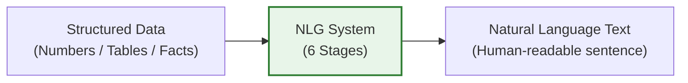
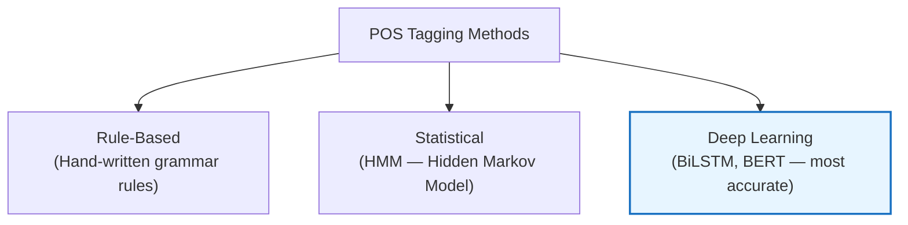
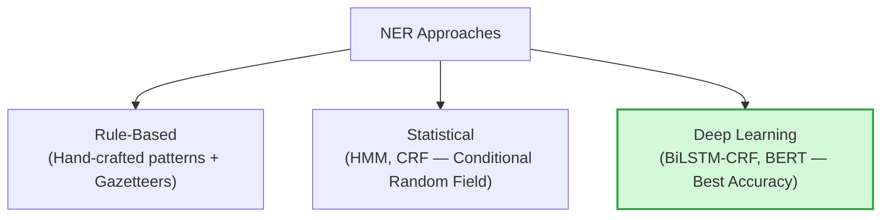

# Unit 2: Language Modeling & Part of Speech Tagging — Complete Study Notes
**Subject:** Natural Language Processing (3174205) | **Unit 2 of 5** | **12 Hours | 28% Weightage (HIGHEST!)**

---

> [!NOTE]
> ### 🎣 The Hook
> How does your phone's keyboard suggest the next word? How does Google Translate produce grammatically fluent sentences? How does Grammarly know *"I goes"* is wrong?
> The answer is **Language Models** — probability engines that have "read" billions of sentences and learned which word sequences are likely. This unit is the biggest unit (12 hrs, 28% marks) — master it!

---

## Topic 1: Unigram Language Model

A **Language Model** assigns a probability to a sequence of words, answering: *"How likely is this sentence to appear in real human text?"*

### Unigram Model (N=1):
The simplest language model. Treats **every word as completely independent** — the probability of a word does NOT depend on any surrounding words.

**Formula:**
$$P(w_1, w_2, w_3, \ldots, w_n) = \prod_{i=1}^{n} P(w_i) = P(w_1) \times P(w_2) \times \cdots \times P(w_n)$$

**How to calculate $P(w_i)$:**
$$P(w_i) = \frac{\text{Count of word } w_i \text{ in corpus}}{\text{Total words in corpus}}$$

**Example:** Corpus = *"the cat sat on the mat"* (6 words)

| Word | Count | Probability |
|------|-------|-------------|
| the | 2 | 2/6 = 0.33 |
| cat | 1 | 1/6 = 0.17 |
| sat | 1 | 1/6 = 0.17 |
| on | 1 | 1/6 = 0.17 |
| mat | 1 | 1/6 = 0.17 |

$P(\text{"the cat"}) = P(\text{"the"}) \times P(\text{"cat"}) = 0.33 \times 0.17 = 0.056$

> ⚠️ **Limitation:** No context! A unigram model thinks *"cat the"* and *"the cat"* are equally probable because it ignores word order.

---

## Topic 2: Bigram Model (N=2)

A **Bigram** model estimates the probability of a word based on the **1 word immediately before it** (the previous word).

**Markov Assumption:** We only need the immediately preceding word, not the entire sentence history.

$$P(w_i | w_{i-1}) = \frac{C(w_{i-1}, w_i)}{C(w_{i-1})}$$

where $C$ = count of how many times that sequence appeared in training.

**Example Sentence:** *"This is a sentence"*

All Bigrams extracted:
| Bigram | Count |
|--------|-------|
| \<START\> This | 1 |
| This is | 1 |
| is a | 1 |
| a sentence | 1 |
| sentence \<END\> | 1 |

$P(\text{"is"} | \text{"This"}) = \frac{C(\text{"This is"})}{C(\text{"This"})} = \frac{1}{1} = 1.0$

**Full sentence probability:**
$$P(\text{"This is a sentence"}) = P(\text{This}|\text{START}) \times P(\text{is}|\text{This}) \times P(\text{a}|\text{is}) \times P(\text{sentence}|\text{a})$$

---

## Topic 3: Trigram Model (N=3)

A **Trigram** model estimates the probability of a word based on the **2 words immediately before it**.

$$P(w_i | w_{i-2}, w_{i-1}) = \frac{C(w_{i-2}, w_{i-1}, w_i)}{C(w_{i-2}, w_{i-1})}$$

**Example Sentence:** *"This is a sentence"*

All Trigrams extracted:
| Trigram |
|---------|
| \<START\> \<START\> This |
| \<START\> This is |
| This is a |
| is a sentence |
| a sentence \<END\> |

---

## Topic 4: N-gram (Generalization)

**N-gram** is the general term for a contiguous sequence of **N words**.

| N | Name | Context Used |
|---|------|-------------|
| 1 | **Unigram** | None — each word independent |
| 2 | **Bigram** | Previous 1 word |
| 3 | **Trigram** | Previous 2 words |
| 4 | **4-gram** | Previous 3 words |
| N | **N-gram** | Previous N-1 words |

**Trade-off:**
- **Higher N** → More context → More accurate → BUT needs much more data
- **Lower N** → Less context → Less accurate → BUT works even with small data

**Data Sparsity Problem:** As N increases, most N-gram sequences will have never appeared in training data (zero counts), causing the zero-probability problem.

---

## Topic 5: Advanced Smoothing for Language Modeling 🔥

**The Problem:** If a word sequence never appeared in training, its count = 0, so probability = 0. Even one 0-probability word makes an entire sentence probability = 0!

### A. Add-One (Laplace) Smoothing — GTU Favorite!

Add 1 to every bigram count, including unseen pairs.

$$P_{Laplace}(w_i | w_{i-1}) = \frac{C(w_{i-1}, w_i) + 1}{C(w_{i-1}) + V}$$

where $V$ = vocabulary size (total unique words).

> **Example:** Training = *"This is a sentence"* (V = 4)
> - Seen bigram: $P(\text{"a"} | \text{"is"}) = \frac{1+1}{1+4} = \frac{2}{5} = 0.4$
> - Unseen bigram: $P(\text{"cat"} | \text{"is"}) = \frac{0+1}{1+4} = \frac{1}{5} = 0.2$ (not 0 anymore!)

### B. Good-Turing Smoothing

Estimate the count of unseen events based on **how many events were seen exactly once**.

**Core Idea:** If we saw some things *once*, there are probably similar things we haven't seen yet. Give those unseen things a small probability based on this estimate.

$$C^*(w_{i-1}, w_i) = \frac{(C(w_{i-1}, w_i) + 1) \times N_{C+1}}{N_C}$$

where $N_C$ = number of N-grams seen exactly $C$ times.

### C. Kneser-Ney Smoothing (Most Effective)

The most widely used smoothing method in practice. Instead of just redistributing counts, it models **how likely a word is to appear as a novel continuation** — measured by how many *different* words it has followed in the corpus.

*"San Francisco"* — *"Francisco"* appears a lot, but only after *"San"*. So Kneser-Ney gives *"Francisco"* low probability as a general word. This is more accurate than Laplace.

---

## Topic 6: Empirical Comparison of Smoothing Techniques

| Method | Simple? | Handles Zeros? | Accuracy | Use When |
|--------|---------|---------------|----------|----------|
| **No Smoothing** | ✅ Simplest | ❌ No | Very Low | Never in practice |
| **Add-One (Laplace)** | ✅ Easy | ✅ Yes | Low–Medium | Small toy datasets, learning |
| **Good-Turing** | Medium | ✅ Yes | Medium | Medium corpora |
| **Kneser-Ney** | Complex | ✅ Yes | **Best** | Production systems |
| **Witten-Bell** | Medium | ✅ Yes | Medium–High | General use |

> 🏆 **Kneser-Ney** consistently outperforms other methods in empirical tests on large corpora. Most modern language model toolkits (SRILM, KenLM) use it as default.

---

## Topic 7: Applications of Language Modeling

Language models are the **core engine** behind:

1. 📱 **Autocomplete / Predictive Text:** Phone keyboard suggests next word using N-gram or neural LM.
2. 🔍 **Speech Recognition:** Selecting the most probable word sequence from audio input (e.g., Alexa, Siri).
3. 🌐 **Machine Translation:** Ensuring translated output is fluent and grammatical.
4. 🤖 **Chatbots / LLMs:** GPT-4, Gemini — trained on trillions of tokens. These are *very deep* language models.
5. 📧 **Spell & Grammar Check:** Grammarly detects unlikely word sequences.
6. 📑 **Text Generation:** Writing assistants that auto-complete paragraphs.
7. 🎯 **Information Retrieval:** Ranking documents by how likely they contain the answer to a query.

---

## Topic 8: Natural Language Generation (NLG)

**NLG** is the process of converting structured data or internal representations into **readable, natural human-language text**.

### The 6 Stages of NLG:

| Stage | Task | Example |
|-------|------|---------|
| **1. Content Determination** | Decide what information to include. | Weather data → only include temperature, condition, and wind. |
| **2. Document Structuring** | Decide the order of information. | Lead with most important fact first. |
| **3. Aggregation** | Combine related information into one sentence. | "It's 32°C and sunny" instead of two sentences. |
| **4. Lexicalization** | Choose the right words and phrases. | "hot" vs "warm" vs "scorching" based on temperature value. |
| **5. Referring Expression Generation** | Use pronouns/references to avoid repetition. | "It will be sunny → It stays sunny → temperatures remain..." |
| **6. Realization** | Apply grammar rules to produce the final grammatical sentence. | Correct verb tense, subject-verb agreement, punctuation. |

**Real-world Example:** Weather apps — raw data `{temp: 32, condition: "sunny"}` → NLG produces: *"It will be a hot and sunny day with temperatures reaching 32°C."*

---

## Topic 9: Parts of Speech (POS) Tagging 🔥

**POS Tagging** is the process of labelling each word in a sentence with its grammatical role (noun, verb, adjective, etc.).

### Standard POS Tags (Penn Treebank Tags):

| Tag | Part of Speech | Example |
|-----|---------------|---------|
| **NN** | Noun (singular) | dog, city, NLP |
| **NNS** | Noun (plural) | dogs, cities |
| **VB** | Verb (base form) | run, eat |
| **VBD** | Verb (past tense) | ran, ate |
| **JJ** | Adjective | happy, fast |
| **RB** | Adverb | quickly, very |
| **IN** | Preposition | in, on, at, of |
| **DT** | Determiner | the, a, an |
| **PRP** | Personal Pronoun | I, he, she, they |
| **CC** | Coordinating Conjunction | and, but, or |

**Example:** *"The quick brown fox jumps"*
→ `The/DT quick/JJ brown/JJ fox/NN jumps/VBZ`

### POS Tagging Approaches:

**Statistical (HMM):** Uses two probabilities:
- **Emission Probability:** $P(\text{word} | \text{tag})$ — e.g., $P(\text{"dog"} | \text{NN})$
- **Transition Probability:** $P(\text{tag}_i | \text{tag}_{i-1})$ — e.g., $P(\text{NN} | \text{DT})$ (a noun after a determiner is likely)

### Why POS Tagging is Useful:
- Helps in parsing sentence structure (syntax analysis).
- Resolves word sense ambiguity (*"book"* as noun vs. verb).
- Essential for Named Entity Recognition.
- Improves machine translation quality.

---

## Topic 10: Morphology 🔥

**Morphology** is the study of the internal structure of words — how words are built from smaller meaning units called **morphemes**.

### What is a Morpheme?
A **morpheme** is the **smallest unit of language that carries meaning**.

- *"cats"* = `cat` (free morpheme — can stand alone) + `s` (bound morpheme — plural suffix)
- *"unbelievable"* = `un-` (prefix) + `believ` (root) + `-able` (suffix)
- *"walked"* = `walk` (root) + `-ed` (past tense morpheme)

### Types of Morphemes:

| Type | Definition | Examples |
|------|-----------|---------|
| **Free Morpheme** | Can stand alone as a complete word | *cat, run, happy, book* |
| **Bound Morpheme** | Cannot stand alone — must attach to another morpheme | *-s, -ed, -ing, un-, re-* |
| **Prefix** | Bound morpheme added at the start | *un-happy, re-write, pre-paid* |
| **Suffix** | Bound morpheme added at the end | *walk-ed, teach-er, quick-ly* |
| **Infix** | Bound morpheme inserted in the middle (rare in English) | Common in Filipino: *sumunod* |

### Morphological Parsing in NLP:
- **Stemming:** Crudely chops off affixes. Fast but inaccurate.
  - `"playing"` → `"play"` | `"studies"` → `"studi"` ❌
- **Lemmatization:** Uses dictionary to find correct base form. Slower but accurate.
  - `"playing"` → `"play"` | `"studies"` → `"study"` ✅ | `"was"` → `"be"` ✅

### Why Morphology Matters in NLP:
- Helps the model understand that *"run"*, *"runs"*, *"ran"*, *"running"* all refer to the same action.
- Reduces vocabulary size significantly — instead of 4 entries, just 1 root form.
- Essential for morphologically rich languages (Arabic, Turkish, Finnish) where one word can have 100+ forms.

---

## Topic 11: Named Entity Recognition (NER) 🔥

**NER** is the task of identifying and classifying **named entities** in text — real-world objects with specific names like people, places, organizations, and dates.

### Standard NER Categories:

| Category | Tag | Examples |
|----------|-----|---------|
| **Person** | PER | *Steve Jobs, Narendra Modi, Elon Musk* |
| **Organization** | ORG | *Apple Inc., Google, GTU, ISRO* |
| **Location** | LOC | *Ahmedabad, India, Silicon Valley* |
| **Date/Time** | DATE | *2024, January 15th, last Monday* |
| **Money** | MONEY | *$500, ₹10,000* |
| **Percentage** | PERCENT | *85%, 3.5%* |

**Example from W24 paper:**
> Sentence: *"Apple Inc. was founded by Steve Jobs and Steve Wozniak in a garage"*
>
> | Token | NER Tag |
> |-------|---------|
> | Apple Inc. | ORG |
> | Steve Jobs | PER |
> | Steve Wozniak | PER |

**From S26 paper:**
> Sentence: *"Steve Jobs co-founded Apple Inc. in 1976, revolutionizing the technology industry..."*
>
> | Token | NER Tag |
> |-------|---------|
> | Steve Jobs | PER |
> | Apple Inc. | ORG |
> | 1976 | DATE |

### NER Approaches:

### Challenges in NER:
1. **Ambiguity:** *"Apple"* = fruit OR company?
2. **Multi-word entities:** *"New York City"* is one entity, not three.
3. **New/rare entities:** NER systems fail on names they've never seen.
4. **Domain specificity:** Medical NER (drug names, diseases) requires domain-specific training.

---

> [!CAUTION]
> ### 🎯 GTU Exam Corner — Unit 2
>
> **Q1. Explain Unigram Language Model. (3 Marks) [S26]**
> → Define language model. State Markov assumption (words independent in unigram). Write formula: $P(w_1...w_n) = \prod P(w_i)$. Small example.
>
> **Q2. Explain Unigram, Bigram, and Trigram using: "This is a sentence". (7 Marks) [W23, W24, W25]**
> → List all unigrams, bigrams, and trigrams of the example sentence. Write formula for each. Show count table.
>
> **Q3. Explain Add-One smoothing with example. (3–4 Marks) [W24, S26]**
> → State problem (zero probability). Write Laplace formula with V. Apply to one unseen bigram example.
>
> **Q4. Explain various smoothing techniques with example. (7 Marks) [W23]**
> → Cover: Add-One (formula + example), Good-Turing (intuition), Kneser-Ney (why it's best). Use comparison table.
>
> **Q5. 🔥 Explain NER with example: "Apple Inc. was founded by Steve Jobs..." (7 Marks) [W24, W25, S26]**
> → Define NER, list entity categories (PER, ORG, LOC, DATE). Tag the example sentence word-by-word. Explain 3 NER challenges.
>
> **Q6. What is morphology? Describe morphology parsing. (4 Marks) [W24, W25]**
> → Define morpheme. Types (free/bound, prefix/suffix). Explain stemming vs. lemmatization with examples. Why it matters in NLP.
>
> **Q7. POS Tagging — Deconstruct with example. (7 Marks) [S26]**
> → Define POS tagging. List 8 common POS tags with examples. Tag the sentence word by word. Explain HMM-based approach (emission + transition probability).

---

## 🧠 Prof. Nova's Active Recall Challenge
1. In a bigram model, to find $P(\text{"sat"} | \text{"cat"})$, what do you divide by what?
2. What does Laplace smoothing ADD to prevent zero probability — and what does the $V$ represent?
3. Name the 6 standard NER categories with one example each.
4. What is the difference between a free morpheme and a bound morpheme? Give 2 examples of each.
5. In POS tagging, what is an "emission probability"?

---
*→ Next: Unit 3 — Words & Word Forms (Bag of Words, Skip-gram, CBOW, WSD)*
