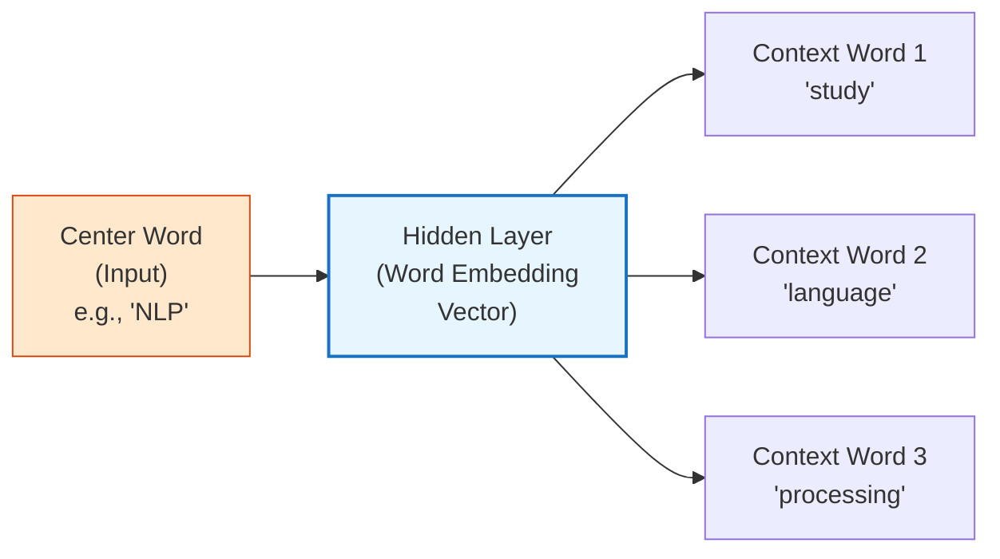
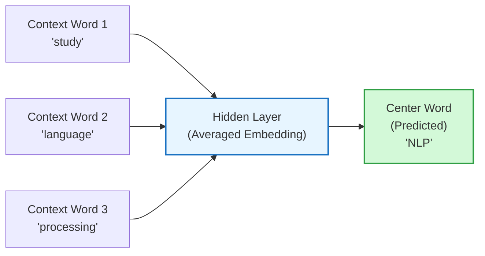
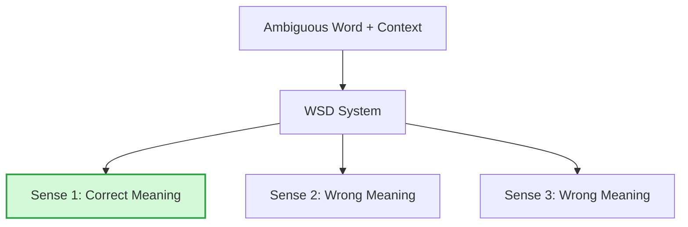

# Unit 3: Words & Word Forms — Complete Study Notes
**Subject:** Natural Language Processing (3174205) | **Unit 3 of 5** | **7 Hours | 14% Weightage**

---

> [!NOTE]
> ### 🎣 The Hook
> How does Google know that *"king − man + woman = queen"*? How does a search engine know that a document about *"automobiles"* is relevant to a search for *"cars"*?
> Words need to be converted into numbers for computers. But not just any numbers — **smart numbers (vectors)** that capture *meaning* and *relationships*. This unit teaches you exactly how that works.

---

## Topic 1: Bag of Words (BoW)

**Bag of Words** is the simplest way to represent text as numbers. The idea: a document is just a "bag" (unordered collection) of words — we count how many times each word appears and ignore grammar/word order entirely.

### How it Works — Step by Step:

**Step 1:** Build a vocabulary from all unique words in the corpus.
**Step 2:** Represent each document as a vector where each position = count of that word.

**Example:**
- Doc 1: *"I love NLP"*
- Doc 2: *"I love cricket"*
- Doc 3: *"NLP is amazing"*

**Vocabulary:** {I, love, NLP, cricket, is, amazing}

| Document | I | love | NLP | cricket | is | amazing |
|----------|---|------|-----|---------|----|---------|
| Doc 1 | 1 | 1 | 1 | 0 | 0 | 0 |
| Doc 2 | 1 | 1 | 0 | 1 | 0 | 0 |
| Doc 3 | 0 | 0 | 1 | 0 | 1 | 1 |

### BoW Pipeline for Text Classification:
*(From W23 Q3c — 7 marks)*
```
Raw Text → Normalize → Tokenize → Remove Stopwords → Build Vocabulary → Count Vectors → ML Classifier
```

### Limitations of BoW:
1. **Ignores word order:** *"Dog bites man"* = *"Man bites dog"* in BoW (same vectors, different meanings!)
2. **High dimensionality:** Vocabulary of 50,000 words → each document is a 50,000-dim sparse vector.
3. **No semantic meaning:** *"car"* and *"automobile"* are treated as completely unrelated words.
4. **Frequent words dominate:** *"the"*, *"is"* appear everywhere — solved by using **TF-IDF** instead of raw counts.

---

## Topic 2: Skip-gram 🔥

**Skip-gram** is a neural network approach that learns word **embeddings** (dense vector representations) by training a model to **predict the surrounding context words** given a center word.

> 💡 *Analogy:* You know a word by the company it keeps. The word *"delicious"* mostly appears near words like *"food"*, *"taste"*, *"restaurant"* — never near *"mathematics"* or *"spaceship"*. Skip-gram learns this.

### Architecture:



### Training Process:
1. Slide a **window** (e.g., size 2) across the training corpus.
2. For each **center word**, use it as input.
3. Try to **predict each word in the window** (context words) as output.
4. Update the embedding weights using backpropagation to minimize prediction error.

**Example:** Sentence: *"I love studying NLP deeply"*, window size = 2

| Center Word | Context Words (to predict) |
|-------------|--------------------------|
| love | I, studying |
| studying | love, NLP |
| NLP | studying, deeply |

### Skip-gram with Negative Sampling (SGNS):
- **Problem:** Predicting from the full vocabulary is computationally expensive.
- **Solution:** For each correct context word, randomly sample a few **non-context (negative) words** and train the model to distinguish real context from random noise.
- **Why faster?** Instead of updating all weights for every word, only update weights for the 1 correct word + k negative samples (e.g., k=5).

---

## Topic 3: Continuous Bag of Words (CBOW) 🔥

**CBOW** is the **opposite** of Skip-gram. Instead of predicting context words from the center word, CBOW **predicts the center word from the surrounding context words**.



### CBOW vs. Skip-gram — Key Comparison:

| Feature | Skip-gram | CBOW |
|---------|-----------|------|
| **Input** | One center word | Multiple context words |
| **Output (Predicts)** | Multiple context words | One center word |
| **Training Speed** | Slower | Faster |
| **Performance on Rare Words** | Better | Worse |
| **Performance on Frequent Words** | Worse | Better |
| **Use When** | Small dataset, need rare word quality | Large dataset, speed matters |

---

## Topic 4: Embedding Representations for Words

**Word Embeddings** are dense, low-dimensional **real-valued vectors** that represent words in a continuous vector space — where similar words have similar vectors.

### Why Embeddings > BoW?

| Aspect | Bag of Words | Word Embeddings |
|--------|-------------|-----------------|
| **Size** | 50,000 dimensions (sparse) | 100–300 dimensions (dense) |
| **Semantic Meaning** | No — "car" ≠ "automobile" | Yes — similar meaning → close vectors |
| **Word Order** | Ignored | Partially captured |
| **Arithmetic** | Impossible | *king − man + woman ≈ queen* |

### The Magic of Embedding Arithmetic:
$$\vec{king} - \vec{man} + \vec{woman} \approx \vec{queen}$$
$$\vec{Paris} - \vec{France} + \vec{India} \approx \vec{Delhi}$$

This works because embeddings capture **relationships and analogies** in their geometry!

### Word2Vec:
**Word2Vec** is the landmark model (Google, 2013) that introduced efficient learning of word embeddings using either the **Skip-gram** or **CBOW** architectures.

### Other Embedding Methods:

| Method | Key Innovation |
|--------|---------------|
| **Word2Vec (2013)** | Skip-gram and CBOW architectures. Fixed vector per word. |
| **GloVe (2014)** | Uses global word co-occurrence statistics (Global Vectors). |
| **FastText (2016)** | Represents words as bags of character n-grams. Handles rare/misspelt words. |
| **BERT (2018)** | Context-dependent embeddings — same word has different vector in different contexts. |

---

## Topic 5: Lexical Semantics

**Lexical Semantics** is the branch of linguistics that studies the meaning of words and the relationships between word meanings.

### Key Concepts:

**Synonymy:** Two words with the same (or very similar) meaning.
- *"car"* ≈ *"automobile"* | *"happy"* ≈ *"glad"*

**Antonymy:** Two words with opposite meaning.
- *"hot"* ↔ *"cold"* | *"fast"* ↔ *"slow"*

**Polysemy:** One word with **multiple related** meanings.
- *"bank"* → financial institution / river bank
- *"head"* → body part / head of department

**Homonymy:** One word with **multiple unrelated** meanings.
- *"bat"* → flying animal / cricket bat (unrelated meanings)

**Hyponymy (IS-A Hierarchy):** A word is a more specific type of another.
- *"poodle"* IS-A *"dog"* IS-A *"animal"*

**Meronymy (PART-OF):** A word is a part of another.
- *"wheel"* PART-OF *"car"* | *"finger"* PART-OF *"hand"*

### WordNet:
**WordNet** is the most famous lexical database for English, organizing words into groups of synonyms called **synsets**.

| Term | Definition | Example |
|------|-----------|---------|
| **Synset** | A group of synonyms that share the same meaning. | {car, auto, automobile, machine, motorcar} |
| **Gloss** | A short definition of a synset. | "4-wheeled motor vehicle; usually propelled by an internal combustion engine" |
| **Supersense** | A coarse semantic category for a synset. | *noun.artifact* (for physical objects made by humans) |

---

## Topic 6: Word Sense Disambiguation (WSD) 🔥

**WSD** is the task of determining which **sense (meaning)** of a word is intended in a given context, when the word has multiple possible meanings.

> 💡 *Example:* The word *"bank"* has 2 main senses:
> - Sense 1: *Financial institution* — *"I deposited money in the bank."*
> - Sense 2: *Riverbank* — *"We picnicked on the river bank."*
> WSD must figure out which sense is meant based on surrounding words.



### Why WSD is Hard:
- A single word can have dozens of senses in a dictionary.
- The correct sense depends on subtle contextual clues.
- Some senses are extremely rare (data sparsity).

---

## Topic 7: Knowledge-Based Word Sense Disambiguation

Uses **external knowledge resources** (like WordNet) — no training data needed.

### Lesk Algorithm (Most Famous):
1. For each possible sense of the ambiguous word, look up its **definition (gloss)** in WordNet.
2. Count how many words in the gloss **overlap** with the words in the surrounding context sentence.
3. The sense whose gloss has the **most overlapping words** wins.

**Example:** *"I deposited money in the bank"*
- Sense 1 Gloss (Financial): *"a financial institution that accepts deposits"* → overlaps: "deposited", "money" → **2 overlaps ✅**
- Sense 2 Gloss (Riverbank): *"sloping land beside a body of water"* → overlaps: none → **0 overlaps**
- **Winner:** Sense 1 (Financial institution) ✅

### Advantages and Disadvantages:

| | Knowledge-Based |
|-|----------------|
| ✅ **Pro** | No training data needed |
| ✅ **Pro** | Uses structured human knowledge (WordNet) |
| ❌ **Con** | Limited by knowledge base coverage |
| ❌ **Con** | Fails on rare or domain-specific words not in WordNet |
| ❌ **Con** | Lesk algorithm performs poorly on short, sparse contexts |

---

## Topic 8: Supervised Word Sense Disambiguation

Uses **annotated training data** (a corpus where human experts have labelled the correct sense of each ambiguous word) to train a classifier.

### How It Works:
1. Collect a corpus with ambiguous words manually labelled with their correct sense.
2. Extract **features** from the surrounding context:
   - The words before and after the target word.
   - POS tags of surrounding words.
   - Collocations (which specific words tend to appear near this sense).
3. Train a classifier (Naïve Bayes, SVM, or Neural Network) to predict the sense.
4. At test time, extract the same features and let the classifier predict the sense.

**Example:** Training on 1000 sentences with *"bank"*:
- Feature: if *"river"* or *"water"* appears nearby → predict Sense 2 (Riverbank)
- Feature: if *"money"* or *"deposit"* appears nearby → predict Sense 1 (Financial)

### Comparison: Knowledge-Based vs. Supervised WSD:

| Feature | Knowledge-Based | Supervised |
|---------|----------------|------------|
| **Training Data** | Not needed | Required (annotated corpus) |
| **Knowledge Resource** | WordNet / Ontology | Training examples |
| **Accuracy** | Lower | Higher |
| **Scalability** | Good | Limited by annotation cost |
| **Domain Adaptation** | Poor | Good (retrain on domain data) |
| **Best Method** | Lesk Algorithm | SVM / Neural classifiers |

---

> [!CAUTION]
> ### 🎯 GTU Exam Corner — Unit 3
>
> **Q1. Explain Bag of Words with example. (3–4 Marks) [W23, W24, W25]**
> → Explain the concept. Build the vocabulary table. Show the count vectors for 2–3 sample sentences. State 2 limitations.
>
> **Q2. BoW Pipeline for Text Classification. (7 Marks) [W23]**
> → Draw the complete pipeline: Raw Text → Normalize → Tokenize → Remove Stopwords → Build Vocabulary → BoW Vector → Classifier. Explain each stage.
>
> **Q3. 🔥 Explain Skip-gram with example. (7 Marks) [W23, W24, W25, S26]**
> → Draw the architecture diagram. Explain: center word → predicts context words. Show window sliding example. Explain Negative Sampling advantage.
>
> **Q4. Explain CBOW with example. (4 Marks) [W24, S26]**
> → Draw the architecture (context → center). Contrast with Skip-gram using the comparison table.
>
> **Q5. 🔥 Explain Word Sense Disambiguation. (7 Marks) [W23, W24, W25, S26]**
> → Define WSD + example (bank). Explain Knowledge-Based approach (Lesk algorithm with example). Explain Supervised approach (features + classifier). Comparison table.
>
> **Q6. Knowledge-Based vs Supervised WSD. (7 Marks) [W25]**
> → Full comparison. Explain Lesk Algorithm with the "bank" example. Explain supervised with features. Use the comparison table from Topic 8.
>
> **Q7. What is word embedding? List types. (3 Marks) [W24]**
> → Define embeddings (dense vector). List: Word2Vec (Skip-gram, CBOW), GloVe, FastText, BERT. Mention the king−man+woman=queen example.

---

## 🧠 Prof. Nova's Active Recall Challenge
1. In Skip-gram, what is the **input** and what does it **predict**? In CBOW, what is the input and what does it predict?
2. Build the BoW vector for: *"cat sat on mat"* using vocabulary {cat, sat, on, mat, the}.
3. What is a **synset** in WordNet? Give one example.
4. In the Lesk Algorithm, how do you decide which sense wins?
5. What arithmetic operation with word vectors gives: *king − man + woman ≈ ?*

---
*→ Next: Unit 4 — Text Analysis, Summarization & Information Extraction*
