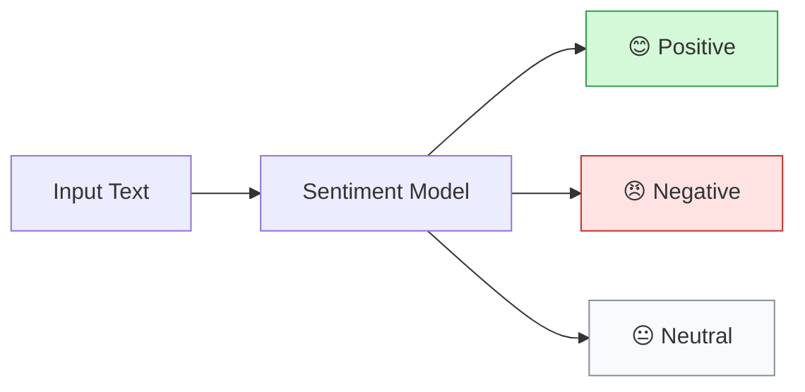
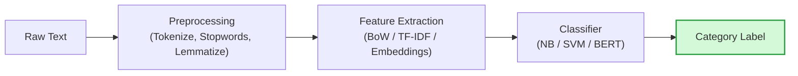
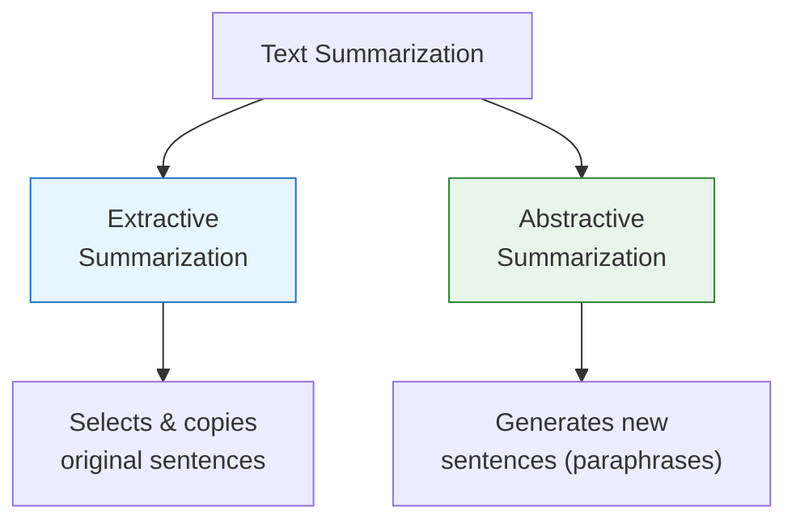
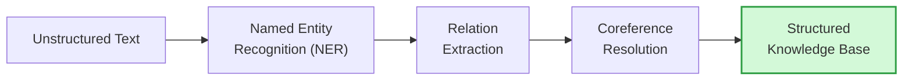
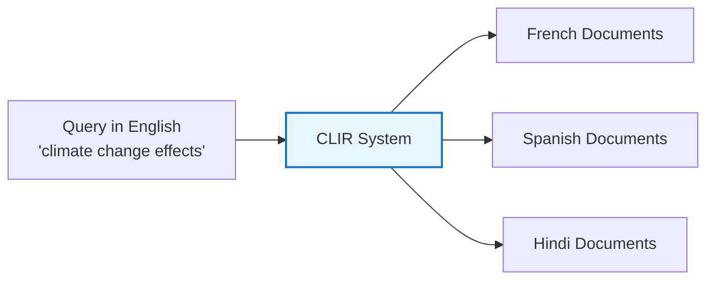

# Unit 4: Text Analysis, Summarization & Extraction — Complete Study Notes
**Subject:** Natural Language Processing (3174205) | **Unit 4 of 5** | **10 Hours | 24% Weightage**

---

> [!NOTE]
> ### 🎣 The Hook
> Imagine you need to read 10,000 customer reviews for a product. Or scan 500 news articles to find all mentions of a specific company. Or search documents in French even though your query is in English.
> This is exactly what Unit 4 teaches — **extracting value from massive text collections** automatically. This is the practical power of NLP.

---

## Topic 1: Sentiment Mining (Sentiment Analysis)

**Sentiment Mining** (also called **Sentiment Analysis** or **Opinion Mining**) is the automated process of identifying and classifying the **emotional tone** or **opinion** expressed in text.

> 💡 *Real use:* A company posts a new product. Millions of tweets are posted. Sentiment analysis automatically classifies each tweet as positive, negative, or neutral — giving instant customer feedback without reading every tweet.

### Types of Sentiment:

| Level | What is Analysed | Example |
|-------|-----------------|---------|
| **Document-level** | The overall sentiment of an entire document. | An entire 5-star review is classified as "positive". |
| **Sentence-level** | Sentiment of each individual sentence. | *"The food was great. BUT the service was terrible."* → Sentence 1 positive, Sentence 2 negative. |
| **Aspect-level** | Sentiment about a specific feature/aspect. | *"The camera is excellent but the battery life is poor."* → Camera: positive, Battery: negative. |

### Sentiment Classes:

### Approaches to Sentiment Analysis:

1. **Lexicon-Based:** Use a pre-built dictionary of words labelled positive/negative (e.g., SentiWordNet). Count positive vs negative words.
2. **Machine Learning:** Train a classifier (Naïve Bayes, SVM) on labelled training data.
3. **Deep Learning:** Use LSTM/BERT models for state-of-the-art accuracy — understand context, negation (*"not good"* ≠ *"good"*).

### Challenges:
- **Negation:** *"This is NOT a good product."* (contains "good" but is negative!)
- **Sarcasm:** *"Oh sure, another delay. Perfect."* (positive words, negative intent)
- **Domain dependency:** *"This phone is sick!"* (negative in medical, positive in slang)

---

## Topic 2: Text Classification

**Text Classification** (or **Document Classification**) is the task of assigning a text document to one or more predefined **categories**.

> 💡 *Examples:* Gmail classifying email as Spam/Not-Spam. Google News categorising articles as Sports/Technology/Politics. Medical system tagging patient notes by disease category.

### Common Text Classification Tasks:

| Task | Categories |
|------|-----------|
| **Spam Detection** | Spam / Not Spam |
| **Sentiment Classification** | Positive / Negative / Neutral |
| **Topic Classification** | Sports / Tech / Politics / Finance |
| **Language Detection** | English / Hindi / French / ... |
| **Intent Classification** | Book flight / Check weather / Play music |

### Pipeline for Text Classification:

### Standard Evaluation Metrics:

$$\text{Precision} = \frac{TP}{TP + FP}, \quad \text{Recall} = \frac{TP}{TP + FN}, \quad F_1 = \frac{2 \times P \times R}{P + R}$$

**Confusion Matrix:** A table showing how well a classifier performed across all categories:

| | Predicted Positive | Predicted Negative |
|--|--|--|
| **Actual Positive** | TP (True Positive) | FN (False Negative) |
| **Actual Negative** | FP (False Positive) | TN (True Negative) |

---

## Topic 3: Text Summarization 🔥

**Text Summarization** is the task of automatically creating a shorter version of a document that retains its most important information.

### Two Main Approaches:

### Dimensions of Text Summarization (GTU Favorite!):

| Dimension | Options |
|-----------|---------|
| **Input Size** | Single Document vs. Multi-Document |
| **Output Type** | Extractive (copies sentences) vs. Abstractive (generates new text) |
| **Purpose** | Generic (captures main ideas) vs. Query-focused (answers a specific question) |
| **Language** | Monolingual vs. Cross-lingual (summarize French document in English) |
| **Domain** | General vs. Domain-specific (medical, legal, news) |

### Extractive Summarization:
- **Selects** the most important sentences from the original document and combines them.
- Sentences are scored using TF-IDF, TextRank (graph-based algorithm), or position (first/last sentences tend to be important).
- Output uses **original words only** — never paraphrases.

### Abstractive Summarization:
- **Generates** a new, shorter text that captures the meaning — may use words not in the original.
- Requires deep language understanding — typically done with sequence-to-sequence neural models (Transformer, BART, T5).
- Output reads more naturally but can introduce errors (hallucinations).

---

## Topic 4: Information Extraction (IE)

**Information Extraction (IE)** is the task of automatically extracting **structured information** (specific facts) from **unstructured text**.

> 💡 *Difference from Search:* Search retrieves relevant documents. IE extracts specific facts FROM those documents.
> *Example:* From a news article, IE extracts: WHO (Steve Jobs), DID WHAT (co-founded), WHAT (Apple Inc.), WHEN (1976).

### IE Pipeline:

### Stages of Information Extraction:

1. **Named Entity Recognition (NER):** Identify named entities (people, organizations, dates).
2. **Relation Extraction:** Find relationships between entities.
3. **Event Extraction:** Identify events (what happened, when, where, who was involved).
4. **Coreference Resolution:** Resolve pronouns to their entities (*"He founded Apple"* → *"Steve Jobs founded Apple"*).
5. **Template Filling:** Fill a predefined schema with extracted facts.

---

## Topic 5: Named Entity Recognition (NER) in IE Context

*(NER was also covered in Unit 2 — here we focus on its role within Information Extraction)*

NER is the **first and most critical stage** of the IE pipeline. Without correctly identifying entities, relation extraction and template filling cannot work.

### The BIO Tagging Scheme:
NER systems use a tagging scheme to label each token:

| Tag | Meaning | Example |
|-----|---------|---------|
| **B-PER** | Beginning of a Person entity | **Steve** Jobs |
| **I-PER** | Inside (continuation of) a Person entity | Steve **Jobs** |
| **B-ORG** | Beginning of an Organization | **Apple** Inc. |
| **I-ORG** | Inside of an Organization | Apple **Inc.** |
| **O** | Outside — not part of any entity | was, founded, in |

**Tagged Example:** *"Steve Jobs founded Apple Inc. in 1976"*
`Steve/B-PER Jobs/I-PER founded/O Apple/B-ORG Inc./I-ORG in/O 1976/B-DATE`

---

## Topic 6: Relation Extraction 🔥

**Relation Extraction (RE)** identifies and classifies the **semantic relationship** between two named entities in a text.

> 💡 *Example:* *"Steve Jobs co-founded Apple Inc."*
> → Entity 1: *Steve Jobs (PER)*, Entity 2: *Apple Inc. (ORG)*, Relation: **FOUNDED-BY**

### Common Relation Types:

| Relation | Example |
|----------|---------|
| WORKS-AT | *"Sundar Pichai works at Google."* |
| FOUNDED-BY | *"Apple was founded by Steve Jobs."* |
| LOCATED-IN | *"ISRO is located in Bengaluru."* |
| BORN-IN | *"Einstein was born in Germany."* |
| PART-OF | *"Gujarat is part of India."* |

### Approaches to Relation Extraction:

1. **Rule-Based:** Hand-crafted patterns using POS tags and entity types.
   - Pattern: `[PER] founded [ORG]` → FOUNDED-BY relation.
2. **Supervised Learning:** Train a classifier on labelled examples with entity pairs and their relation labels.
3. **Distant Supervision:** Automatically generate training data by aligning existing knowledge bases (Wikipedia) with text.

---

## Topic 7: Question Answering in Multilingual Setting

**Question Answering (QA)** is the task of automatically answering questions posed in natural language.

### Types of QA Systems:

| Type | How It Works | Example |
|------|-------------|---------|
| **Factoid QA** | Returns a specific fact (person, date, number). | *"Who founded Apple?"* → *"Steve Jobs"* |
| **Open-Domain QA** | Searches a large knowledge base or the web for the answer. | Google's featured snippets. |
| **Closed-Domain QA** | Answers questions from a specific domain corpus. | Medical QA, Legal QA. |
| **Reading Comprehension QA** | Given a passage, answer questions about it. | SQuAD dataset — BERT-based models. |

### Phases of an IR-Based QA Model:

### Multilingual QA Challenges:
- Answering questions in one language (e.g., Hindi) from documents in another language (e.g., English).
- Requires Cross-Lingual embeddings (mBERT, XLM-R) trained on 100+ languages simultaneously.
- Challenge: Low-resource languages have fewer training examples for fine-tuning.

---

## Topic 8: NLP in Information Retrieval 🔥

**Information Retrieval (IR)** is the task of finding relevant documents from a large collection in response to a user query.

> 💡 *Examples:* Google Search, PubMed (medical literature search), Lexis Nexis (legal document search).

### How NLP Improves IR:

| NLP Technique | How it Helps IR |
|--------------|----------------|
| **Tokenization & Stemming** | Matches *"running"* to documents containing *"run"*, *"ran"*. |
| **Named Entity Recognition** | Identifies that the query *"Apple earnings"* refers to the company, not the fruit. |
| **Query Expansion** | Automatically adds synonyms to a query (*"car"* → also search for *"automobile"*, *"vehicle"*). |
| **Language Models** | Rank documents by probability that they would generate the query. |
| **Word Embeddings** | Find semantically similar documents even if they don't share exact keywords. |

### Traditional IR vs. NLP-Enhanced IR:

| | Traditional IR (TF-IDF) | NLP-Enhanced IR |
|-|------------------------|-----------------|
| **Matching** | Exact keyword matching | Semantic similarity matching |
| **Query Understanding** | No — treats query as bag of keywords | Yes — understands query intent |
| **Synonym Handling** | Poor | Good (via embeddings/expansion) |
| **Accuracy** | Lower | Higher |

---

## Topic 9: Cross-Lingual Information Retrieval 🔥

**Cross-Lingual IR (CLIR)** is the task of finding relevant documents written in **language B** using a query written in **language A**.

> 💡 *Example:* A researcher types a query in English → CLIR finds relevant French, German, and Spanish documents automatically.

### Approaches to Cross-Lingual IR:

1. **Query Translation:** Translate the user's query into the target document language using Machine Translation, then run standard IR.
   - *English query → translated to French → search French documents*
2. **Document Translation:** Translate all documents into the query language.
   - Expensive computationally — must translate entire corpus.
3. **Cross-Lingual Embeddings (Best Modern Approach):** Map words from both languages into the **same shared vector space**. *"car"* (English) and *"voiture"* (French) become close vectors — then similarity search works across languages.

### Challenges of CLIR:
- Machine translation errors propagate into retrieval errors.
- Proper nouns, domain-specific terms are often mistranslated.
- Cultural and linguistic gaps that no translation captures perfectly.

---

> [!CAUTION]
> ### 🎯 GTU Exam Corner — Unit 4
>
> **Q1. What is Sentiment Mining and its types? (3 Marks) [W23, W24, W25, S26]**
> → Define sentiment analysis. 3 types: document-level, sentence-level, aspect-level. 3 sentiment classes: positive, negative, neutral.
>
> **Q2. What is Information Extraction? How does it differ from data retrieval? (4 Marks) [S26]**
> → IR finds documents. IE extracts specific structured facts from text. Draw IE pipeline: NER → Relation Extraction → Template Filling.
>
> **Q3. 🔥 Explain Text Summarization with different dimensions. (7 Marks) [W24, W25, S26]**
> → Define. Extractive vs. Abstractive. 5 dimensions: input size, output type, purpose, language, domain. Examples for each.
>
> **Q4. Explain Relation Extraction via Supervised Learning. (4 Marks) [W23]**
> → Define RE. Common relation types. Supervised approach: labelled entity pairs → feature extraction → classifier → relation label.
>
> **Q5. 🔥 Explain how NLP is useful in Information Retrieval. (7 Marks) [W23, W25, S26]**
> → NLP techniques in IR: tokenization/stemming, NER, query expansion, language models, word embeddings. Comparison table: traditional vs NLP-enhanced IR.
>
> **Q6. 🔥 Explain phases of an IR-based QA model. (7 Marks) [W25, S26]**
> → Draw flowchart: Question Processing → Document Retrieval → Passage Retrieval → Answer Extraction. Explain each phase.
>
> **Q7. Explain Cross-Lingual IR. (4–7 Marks) [W23, W24, W25]**
> → Define CLIR + example. 3 approaches: query translation, document translation, cross-lingual embeddings. 2 challenges.

---

## 🧠 Prof. Nova's Active Recall Challenge
1. What is **aspect-level** sentiment analysis? Give an example sentence where the aspects have opposite sentiments.
2. What is the difference between **extractive** and **abstractive** summarization?
3. In the BIO tagging scheme, what does **B-ORG** mean? Give an example token.
4. What is **query expansion** in IR, and how does it help with synonyms?
5. In CLIR, what is the **cross-lingual embeddings** approach and why is it better than query translation?

---
*→ Next: Unit 5 — Machine Translation (Need, Problems, Approaches, SMT, NMT, Encoder-Decoder)*
