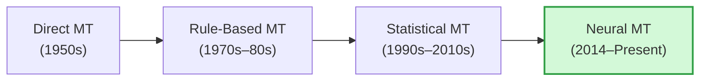
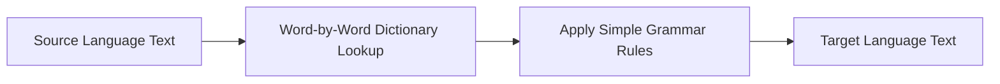
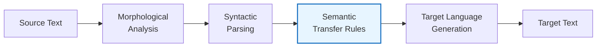
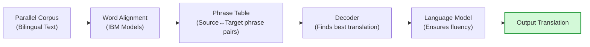
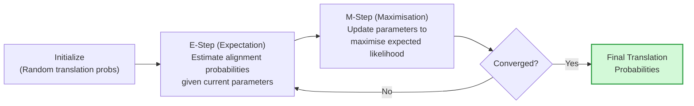
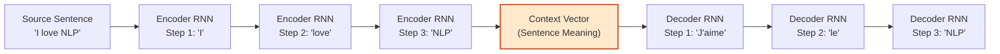

# Unit 5: Machine Translation — Complete Study Notes
**Subject:** Natural Language Processing (3174205) | **Unit 5 of 5** | **10 Hours | 20% Weightage**

---

> [!NOTE]
> ### 🎣 The Hook
> In 1954, IBM and Georgetown University demonstrated the first automatic translation of Russian sentences into English. It used just 250 vocabulary words and 6 grammar rules. Scientists predicted machine translation would be "solved" within 5 years.
> It took 65 more years and the invention of deep neural networks before translation became genuinely useful. Today, Google Translate handles 100+ languages and 100 billion words per day. This is the story of **Machine Translation**.

---

## Topic 1: Need of Machine Translation (MT)

**Machine Translation (MT)** is the use of software to automatically translate text or speech from one human language (source language) to another (target language).

### Why We Need MT:

1. **Globalisation:** Businesses operate across countries — product manuals, legal contracts, websites must be in local languages.
2. **Information Access:** Billions of web pages are in languages the user cannot read. MT makes all knowledge accessible.
3. **Crisis Response:** In disaster relief, first responders need to communicate across language barriers instantly.
4. **Real-time Communication:** WhatsApp, Skype, and similar apps use MT for live chat translation between speakers of different languages.
5. **Cost Efficiency:** Human translators are expensive and slow — MT enables instant, affordable translation at scale.
6. **Scientific Research:** Research papers published in non-English languages become accessible to the global research community.

---

## Topic 2: Problems of Machine Translation

MT is one of the hardest NLP problems because translation is not just word-for-word substitution:

| Problem | Explanation | Example |
|---------|-------------|---------|
| **Lexical Ambiguity** | One word = multiple translations depending on context. | "bank" → *बैंक* (financial) or *किनारा* (riverbank) in Hindi |
| **Structural Difference** | Languages have different word order (SVO, SOV, VSO). | English: *"I eat rice"* (SVO) → Japanese: *"I rice eat"* (SOV) |
| **Idiomatic Expressions** | Literal translation of idioms is meaningless. | *"It's raining cats and dogs"* → cannot translate word-for-word |
| **Morphological Complexity** | Some languages pack many meanings into one word. | Finnish: *talossanikin* = *"in my house too"* (one word = 4 English words) |
| **Named Entity Translation** | Proper nouns need transliteration or cultural adaptation. | *"WhatsApp"* → kept as-is; but person names may be transliterated |
| **Lack of Parallel Data** | Many language pairs have almost no parallel training text. | Translating Gujarati ↔ Swahili is extremely difficult. |
| **Preserving Pragmatics** | Tone, formality, and cultural nuance are lost. | French has formal (*vous*) and informal (*tu*) — which to use? |

---

## Topic 3: MT Approaches (Overview)

Machine Translation has evolved through 4 major paradigm shifts:

---

## Topic 4: Direct Machine Translation

**Direct MT** is the oldest and simplest approach. It works by:
1. Looking up each source word in a **bilingual dictionary**.
2. Applying simple **local grammar rules** to reorder words.
3. Producing the translated output word by word.

### Example:
English: *"The boy plays football"*
→ Dictionary lookup: The=El, boy=niño, plays=juega, football=fútbol
→ Apply Spanish word order: *"El niño juega fútbol"* ✅ (works by coincidence here)

### Drawbacks:
- Completely **fails for idioms** and complex sentences.
- No understanding of sentence-level context.
- Requires a separate system for EVERY language pair (100 languages = 9,900 separate systems).
- Cannot handle morphological variations (*"runs"*, *"running"*, *"ran"* all need separate entries).

---

## Topic 5: Rule-Based Machine Translation (RBMT)

**RBMT** uses hand-crafted **linguistic rules** created by expert linguists to perform translation. It analyses the source sentence deeply, builds an internal representation, then generates the target sentence.

### Architecture (Transfer-Based RBMT):

### 3 Types of RBMT:

| Type | Description |
|------|-------------|
| **Direct** | Source → Target with minimal analysis (word replacement + local reordering). |
| **Transfer-Based** | Source analysis → Structural transfer → Target generation. Works at syntax level. |
| **Interlingual** | Source → Universal abstract representation (interlingua) → Target. Language-independent intermediate. |

### Advantages of RBMT:
- Linguistically principled and transparent — rules are human-readable.
- Works well for closely related languages (Spanish ↔ Portuguese).

### Disadvantages:
- Rules are hand-crafted → enormously expensive in human expert time.
- Cannot handle all exceptions, slang, or informal text.
- Scaling to new language pairs requires rebuilding all rules from scratch.

---

## Topic 6: Knowledge-Based MT System

**Knowledge-Based MT** extends rule-based approaches by incorporating **structured world knowledge** (ontologies, semantic networks) to better understand and translate text.

### How it differs from RBMT:
- Uses domain-specific knowledge bases to resolve ambiguity.
- Example: A medical MT system uses a medical ontology to correctly translate drug names, procedures, and diagnoses.
- Example: A legal MT system uses a legal knowledge base to distinguish between similar legal terms across jurisdictions.

### Components:
1. **Lexical Knowledge Base:** Bilingual dictionaries + synonym information.
2. **Ontological Knowledge:** Domain-specific concept hierarchies (e.g., SNOMED CT for medicine).
3. **Inference Rules:** Logic rules that reason about the meaning of sentences.

### Limitation:
Knowledge bases are domain-limited and require massive manual curation. They do not generalise well to open-domain text.

---

## Topic 7: Statistical Machine Translation (SMT) 🔥

**SMT** replaces hand-crafted rules with **statistics learned from large amounts of parallel text** (bilingual corpora — the same text in both languages side-by-side).

### Core Idea (Noisy Channel Model):

$$P(\text{target} | \text{source}) = \arg\max_T P(T|S) = \arg\max_T \underbrace{P(S|T)}_{\text{Translation Model}} \times \underbrace{P(T)}_{\text{Language Model}}$$

- **Translation Model $P(S|T)$:** What source words/phrases does a given target phrase translate to?
- **Language Model $P(T)$:** Is the target sentence grammatically fluent?

The decoder finds the target sentence T that maximises both probabilities simultaneously.

### SMT Pipeline:

### Phrase-Based SMT:
Instead of word-by-word alignment, Phrase-Based SMT aligns **phrases** (multi-word sequences):
- *"the car"* (English) → *"la voiture"* (French) as a single unit.
- This handles local word reordering better than word-by-word approaches.

---

## Topic 8: Parameter Learning in SMT (IBM Models + EM Algorithm)

### IBM Models:
**IBM Models (1–5)** are a series of statistical word alignment models developed at IBM in the early 1990s that learn how words in a source sentence correspond to words in a target sentence.

- **IBM Model 1:** Simplest. Assumes any source word can align to any target word with equal probability. Ignores word order.
- **IBM Model 2:** Adds positional alignment — words in similar positions are more likely to align.
- **IBM Models 3–5:** Progressively add fertility (one word translates to multiple words), word order distortion, and phrase-level modelling.

### The EM Algorithm (Expectation-Maximisation):

IBM models are trained using the **EM algorithm** because we have a *hidden* variable — the actual word alignments are not given in the training data (we only have the parallel sentence pairs, not which specific words correspond).

**EM works in 2 repeating steps:**

**E-Step:** Given the current translation probability table, estimate how likely each possible word alignment is for every sentence pair.

**M-Step:** Update the translation probabilities to reflect the expected alignments from the E-step.

**Repeat** until the probabilities stop changing (convergence).

> 💡 *Example:* Parallel sentences: `"the house" ↔ "la maison"`
> EM starts with equal probability for all alignments, then iteratively learns:
> - `the` → `la` (high probability)
> - `house` → `maison` (high probability)
> - `the` → `maison` (low probability)

---

## Topic 9: Encoder-Decoder Architecture 🔥

The **Encoder-Decoder** (also called Sequence-to-Sequence or Seq2Seq) architecture is a neural network design that takes a **variable-length input sequence** and produces a **variable-length output sequence** — perfect for translation.

### How It Works:

**Encoder:**
- Reads the source sentence **word by word**.
- Each word updates a **hidden state** (a vector of numbers).
- After reading the last word, produces a **context vector** (also called thought vector) — a fixed-size dense vector that encodes the meaning of the entire source sentence.

**Decoder:**
- Takes the context vector as its initial hidden state.
- Generates the target sentence **one word at a time**.
- At each step, it takes the previous word generated and the current hidden state to predict the next word.

### The Bottleneck Problem:
- The entire source sentence must be compressed into **one fixed-size context vector**.
- For long sentences, this vector cannot capture all the information — quality degrades.
- **Solution:** **Attention Mechanism** — instead of one fixed vector, the decoder looks at **all encoder hidden states** and dynamically focuses on the most relevant source words at each decoding step.

---

## Topic 10: Neural Machine Translation (NMT) 🔥

**NMT** uses deep neural networks (primarily Encoder-Decoder with Attention) to translate text, learned end-to-end from parallel data without hand-crafted rules or phrase tables.

### NMT vs. SMT:

| Feature | Statistical MT (SMT) | Neural MT (NMT) |
|---------|---------------------|-----------------|
| **Architecture** | Separate components (alignment, LM, decoder) | One unified neural network |
| **Translation Unit** | Words / Phrases | Subword tokens (BPE) |
| **Context Window** | Limited (local phrases) | Full sentence (with attention) |
| **Rare Word Handling** | Poor | Better (subword tokenization) |
| **Training Data Needed** | Less | More |
| **Fluency** | Lower | Higher — outputs read naturally |
| **Current Usage** | Largely replaced | Dominant (Google Translate, DeepL) |

### The Transformer (2017) — The Game Changer:
The paper **"Attention Is All You Need"** (Vaswani et al., 2017) replaced the RNN-based Encoder-Decoder with a **Transformer** architecture that uses **self-attention** — allowing the model to look at all words in the sentence simultaneously (not sequentially like RNNs).

**Why Transformers outperform RNN-based NMT:**
- Parallelizable (RNNs must process sequentially).
- Better at capturing long-range dependencies.
- Scales to much larger datasets and model sizes.

**Modern NMT Systems:**
- **Google Translate:** Switched to neural MT in 2016.
- **DeepL:** Considered the highest quality neural MT for European languages.
- **NLLB (No Language Left Behind):** Meta's NMT model covering 200 languages including low-resource languages.

---

> [!CAUTION]
> ### 🎯 GTU Exam Corner — Unit 5
>
> **Q1. What is Machine Translation? Why do we need it? (3 Marks) [W23, S26]**
> → Define MT. List 4 needs: globalisation, information access, real-time communication, cost efficiency.
>
> **Q2. List the problems / challenges of Machine Translation. (3 Marks) [W24, W25, S26]**
> → Use the table from Topic 2: lexical ambiguity, structural difference, idioms, morphological complexity, parallel data scarcity.
>
> **Q3. 🔥 Draw and explain the Encoder-Decoder architecture for MT. (4–7 Marks) [W23, W24, W25, S26 — ALL PAPERS]**
> → Draw the full diagram. Explain encoder (reads source, produces context vector). Explain decoder (uses context vector, generates target word-by-word). Mention the bottleneck problem and attention as solution.
>
> **Q4. 🔥 Write a note on Statistical Machine Translation (SMT). (7 Marks) [W23, W25, S26]**
> → Explain the noisy channel model formula. Translation model + language model. Phrase-Based SMT. IBM Models (briefly). Draw SMT pipeline.
>
> **Q5. 🔥 Write a note on Neural Machine Translation (NMT). (7 Marks) [W23, W25, S26]**
> → Explain Seq2Seq with attention. Compare with SMT using the table. Mention Transformer (2017) breakthrough. Modern examples.
>
> **Q6. Explain Rule-Based Machine Translation. (3–4 Marks) [W25, S26]**
> → 3 types: Direct, Transfer-Based, Interlingual. Draw Transfer-Based pipeline. Advantages (transparent rules) and disadvantages (expensive, doesn't scale).
>
> **Q7. Explain parameter learning in SMT using EM. (7 Marks) [W25]**
> → Explain why EM is needed (hidden alignment variable). E-step definition. M-step definition. Draw iterative convergence diagram. Small word alignment example.

---

## 🧠 Prof. Nova's Active Recall Challenge
1. In the noisy channel model for SMT, what are the two probability terms and what does each measure?
2. What is the **bottleneck problem** in the basic Encoder-Decoder architecture, and how does **attention** solve it?
3. Name **3 problems of Machine Translation** with one example each.
4. In the EM algorithm for IBM Models, what is the **hidden variable** that we cannot observe directly?
5. What major paper introduced the **Transformer** architecture, and in which year?

---

## 📚 Complete NLP Unit Summary

| Unit | Key Topics | Marks |
|------|-----------|-------|
| **Unit 1** | What is NLP, Difficulty, History, Advantages/Disadvantages, Components, Applications, Pipeline, **6 Phases**, NLP APIs, Libraries | 14% |
| **Unit 2** | Unigram/Bigram/Trigram, N-gram, **Smoothing**, Applications of LM, NLG, **POS Tagging**, **Morphology**, **NER** | 28% |
| **Unit 3** | **BoW**, **Skip-gram**, **CBOW**, Embeddings, Lexical Semantics, **WSD**, Knowledge-Based WSD, Supervised WSD | 14% |
| **Unit 4** | **Sentiment Mining**, Text Classification, **Text Summarization**, **IE**, NER in IE, **Relation Extraction**, QA, **NLP in IR**, **Cross-Lingual IR** | 24% |
| **Unit 5** | Need/Problems of MT, Approaches, **Direct MT**, **RBMT**, Knowledge-Based MT, **SMT (IBM+EM)**, **Encoder-Decoder**, **NMT** | 20% |

> 🎯 **Study Priority:** Unit 2 (28%) > Unit 4 (24%) > Unit 5 (20%) > Unit 1 (14%) = Unit 3 (14%)
